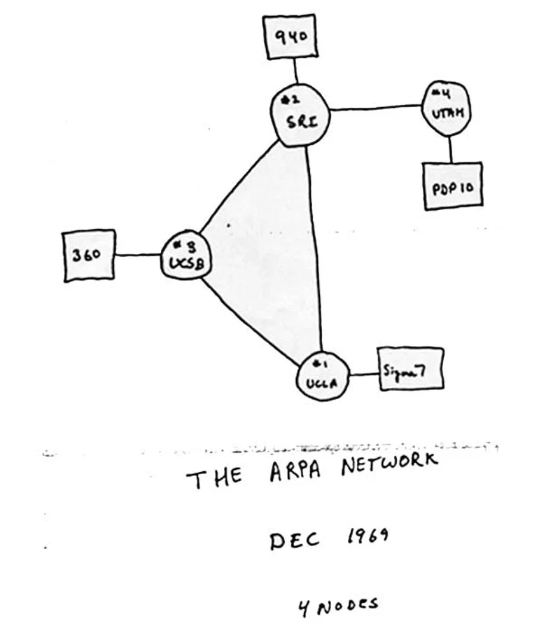

# How the Internet Works: A Friendly Guide

## Overview
You are about to learn how the Internet works. We will cover what the Internet is, how information is sent, and the tools and rules that keep it running. This guide is for beginners and those who want to refresh their knowledge about the Internet.

## Lesson Outcomes
By the end of this lesson, you will be able to:

- Define the Internet: Understand the Internet as a large network and its origins.
- Explain Data Transfer: Learn how data is split into small packets and moves through devices to reach its destination.
- Identify Key Protocols: Learn about important protocols like IP, TCP, HTTP, HTTPS, DNS, and more.
- Understand Network Devices: Know what routers, IP addresses, and domain names are and what they do.
- Differentiate HTTP and HTTPS: Understand how these protocols work and why HTTPS is more secure.
- Explore Emerging Trends: Get an overview of 5G, IoT, AI, blockchain, edge computing, and other new technologies.

## Explanation

With the growth of web applications today, knowing how the Internet works is very important for developers. This knowledge helps developers build and fix web applications better.

### By reading this, you'll be able to answer:

- **What is the Internet?**
- **How does information travel online?**
- **How do networks talk to each other, and what rules do they use?**
- **What is the link between packets, routers, and reliability?**
- **How do HTTP and HTML work together to show this webpage in your browser?**
- **How is data kept safe when sent over the Internet?**
- **What is cybersecurity, and what are some common online crimes?**

## What is the Internet

Before we explain the Internet, let's understand a network. A network is a group of computers or devices connected to each other. You might have devices at home connected to each other or to your neighbor's devices. The Internet is a collection of these connected networks.

In short, the **Internet** is a network of networks.

The Internet was first created in the late 1960s by the United States Department of Defense. It was made to be a communication system that could keep working even during a nuclear attack. Today, the Internet has grown into a huge global network.

Now, the Internet has billions of pages connected together. It is a key part of our daily lives, used by people worldwide to access information, share messages, make business deals, and much more. For developers, knowing how the Internet works and the technologies and protocols that support it is essential.

## A Brief History: The Internet’s Origins

The Internet started in the late 1960s when the United States Department of Defense wanted to build a strong and spread-out communication system. It was made to stay working even during big disruptions like a nuclear attack. Today, what began as a military project has grown into a vast web connecting billions of devices around the world. Whether you’re checking emails, watching videos, or working online, the Internet is a big part of modern life. It's important for developers to understand its basic principles.

## The Mechanics: How Does the Internet Operate?

### Packet-Switching: The Heart of Data Transfer

When you send data over the Internet—like an email, a web request, or a file—the information is split into small parts called packets. Each packet travels on its own through the network:

- Routers are devices that guide these packets, finding the best path from your device to the destination.
- Along the way, packets may go through several routers until they reach their final place, where they are put back together into the original data.

### Protocols: The Rules of the Road

To make sure data is sent smoothly and correctly, the Internet uses set rules called protocols. Two key protocols are:

- **Internet Protocol (IP):** It handles the addressing and routing of each packet, making sure it goes to the right place.
- **Transmission Control Protocol (TCP):** It works with IP to ensure packets are delivered correctly and in order.

Other protocols like User Datagram Protocol (UDP), Hypertext Transfer Protocol (HTTP), and HTTPS are important for different types of data exchange, improving both speed and security.

## Key Concepts and Terminology
To understand Internet communications, know these basic terms:

- **Packet:** A small piece of data sent over the Internet.
- **Router:** A device that directs packets between networks.
- **IP Address:** A unique set of numbers (e.g., 192.168.1.1) that identifies each device on a network.
- **Domain Name:** An easy-to-remember address (like example.com) for a website.
- **DNS (Domain Name System):** The service that changes domain names into IP addresses.
- **HTTP/HTTPS:** Protocols for sending data between web browsers and servers. HTTP handles basic transfers, while HTTPS adds encryption to keep data safe.

## Deep Dive: Understanding Protocols in Internet Communication
Protocols are the languages that computers use to communicate. They:

- Set how data is packaged and sent.
- Ensure devices from different makers can talk to each other.

For example, any web browser or server can share and show web content correctly by following protocols like HTTP. Other important protocols include:

- **UDP:** Offers faster but less reliable data transfer for apps where speed matters more.
- **DNS:** Changes easy-to-read domain names into IP addresses, making it simpler to access online resources.

## The Role of IP Addresses and Domain Names
Every device online has an IP address, which is key for directing digital traffic. But numbers can be hard to remember, so we use domain names (e.g., google.com) instead. When you type a domain name in your browser, a DNS server changes it into the right IP address, allowing your device to find and connect to the website or service you want.

## Secure Communication: HTTP Versus HTTPS

### HTTP: The Basic Web Protocol
HTTP (Hypertext Transfer Protocol) is the main protocol for sending information on the web. When you visit a website, your browser sends an HTTP request to the server, which then sends back the webpage data.

### HTTPS: Elevating Security
For actions involving personal or sensitive data, HTTPS is used. It uses SSL/TLS encryption to keep the information between your browser and the server safe from eavesdroppers. When browsing a secure site, you might see a padlock icon in your address bar, showing the connection is safe and encrypted.

## Developing Applications with TCP/IP
TCP/IP (Transmission Control Protocol/Internet Protocol) is the main system for most internet communications. It ensures that data can be sent reliably across different devices and networks. When building applications that use TCP/IP, keep these ideas in mind:

### Ports
- **Definition:** Ports are numbers assigned to specific apps or services on a device.
- **Purpose:** They make sure incoming data goes to the right app. Each service listens on a specific port, helping the operating system direct the traffic properly.

### Sockets
- **Definition:** A socket is a combination of an IP address and a port number that creates a specific point for communication.
- **Usage:** Sockets are how devices start connections and exchange data, acting as the "doors" for network communication.

### Connections
- **Establishing Communication:** A connection is made when two sockets on different devices agree to talk. They set up things like maximum segment size and window size to make data transfer smooth.
- **Data Flow:** Once connected, data is sent in pieces, each with sequence numbers and details to ensure it arrives in order and without errors.

### Data Transfer Protocols
While TCP/IP is the core, modern apps often use higher-level protocols like HTTP, FTP (File Transfer Protocol), or SMTP (Simple Mail Transfer Protocol) for specific types of data exchange. Knowing these protocols is important for building reliable and scalable services.

## Securing Communication with SSL/TLS
Today, security is very important. SSL/TLS (Secure Sockets Layer/Transport Layer Security) protocols provide the encryption needed to protect sensitive data during transfer.

### Certificates
- **Role:** SSL/TLS certificates link a site's identity to a public key.
- **Verification:** These certificates are given by trusted Certificate Authorities (CAs), making sure users can trust the server's identity.

### The Handshake Process
- **Negotiation:** When a client (like a browser) connects to a server, they start a handshake—a process where both sides share information about encryption methods and security settings.
- **Purpose:** This makes sure both sides agree on a safe way to encrypt data, protecting the communication that follows.

### Encryption
- **Securing Data:** After the handshake, data is encrypted before it is sent using the chosen encryption method. This keeps sensitive information like passwords, payment details, and personal data safe from unauthorized access.
- **Key Takeaway:** Make sure your application uses SSL/TLS correctly—not just by encrypting data but also by keeping certificates up to date and following best security practices. This protects both your users and your service.

## Looking Ahead: Emerging Trends and Technologies
The Internet keeps changing, with new technologies always improving what we can do. As a developer, keeping up with these trends helps you build new, efficient, and future-ready applications.

### 5G Networks
- **Overview:** The fifth generation of mobile technology offers much faster speeds, lower delays, and more capacity.
- **Impact:** 5G will speed up uses like augmented reality, self-driving cars, and real-time remote services.

### Internet of Things (IoT)
- **Definition:** IoT is the large network of connected devices—from home appliances to factory machines.
- **Potential:** IoT is changing areas like healthcare, transportation, and manufacturing by allowing automated data collection and better decision-making.

### Artificial Intelligence (AI)
- **Applications:** AI, through machine learning and language processing, powers services like voice assistants, recommendation systems, and advanced data analysis.
- **Future Transformation:** As AI grows, it will be used more in different industries, improving personalization, efficiency, and problem-solving.

### Blockchain
- **Essence:** Blockchain is a distributed ledger technology that ensures secure, transparent, and unchangeable transactions.
- **Use Cases:** Beyond cryptocurrencies, blockchain is used in areas like supply chain management, digital identity verification, and contract execution.

### Edge Computing
- **Concept:** Edge computing means processing data near the source (the "edge" of the network) instead of in central data centers.
- **Benefits:** This reduces delays and uses less bandwidth, making it great for real-time analysis, IoT devices, and apps that need quick responses.

## Suggested Reading

For more information and a deeper understanding of Internet technologies, check out these resources:

### Books:
- "How the Internet Works" by Preston Gralla
- "TCP/IP Illustrated" by W. Richard Stevens

### Online Articles & Tutorials:
- MDN Web Docs: Detailed tutorials and information on web protocols and Internet technologies.
- HowStuffWorks – Internet: An easy-to-understand overview of how the Internet works.

### Official Documentation & Standards:
- RFC Documents: Look at the official Request for Comments (RFC) documents for detailed technical standards (e.g., RFC 791 for IP, RFC 793 for TCP).

### Research Papers & Journals:
- Academic journals and conference papers on the latest developments in network communication, cybersecurity, and new Internet technologies.
