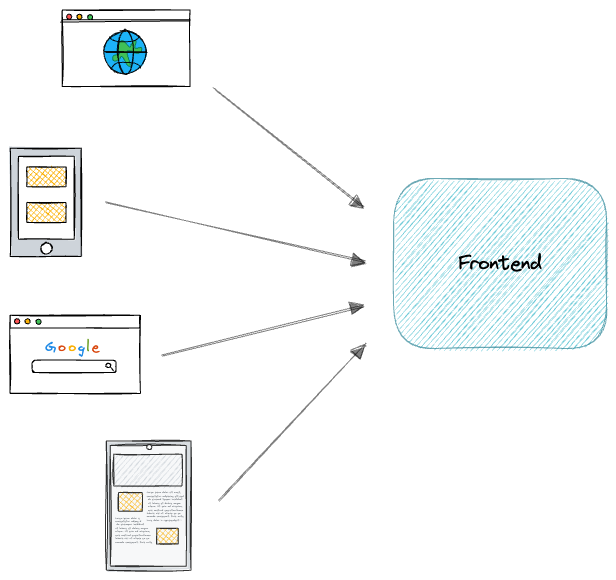
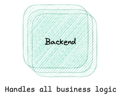

# Components of Applications: A Beginner's Guide

## Overview

This lesson explains how web and mobile apps work. We break down the core parts that build every application. You will learn about the frontend, backend, databases, and APIs. We also cover how clients and servers talk to each other. In addition, we show you how web apps use HTTP/HTTPS. You will see the flow of simple requests and replies. We cover GET and POST methods. You will learn the meaning of status codes like 200, 404, and 500. This guide uses plain language and short sentences to help you get started.

## Lesson Outcomes

By the end of this lesson, you will be able to:

- **Differentiate Core Components:** Tell apart the roles of the frontend, backend, and databases.
- **Understand APIs:** Explain how APIs let different app parts talk to each other.
- **Explain Client-Server Architecture:** Describe how clients and servers work together.
- **Know Web Communication:** Understand HTTP/HTTPS and how they pass data.
- **Describe Request-Response Flow:** Explain how GET and POST work in app tasks.
- **Interpret Status Codes:** Recognize what codes like 200, 404, and 500 mean for an app.

These clear goals will help you grasp the basics. You will soon see how these pieces form a strong app.

## 1. Components of Applications

Apps are built from several key parts. Each part has a role that makes the app work. In this lesson, we focus on three main building blocks. They are the frontend, backend, and database.

### a. Frontend vs. Backend vs. Database

#### Frontend

The **frontend** is what users see on a screen. It is the visual part of the app. Web pages, mobile screens, and interactive forms come from the frontend. It uses languages like HTML, CSS, and JavaScript. Tools such as React, Angular, or Vue help in building web pages. Mobile apps use tools like Swift, Kotlin, or React Native.

The frontend is where you click buttons, type text, and see images. It shows information and collects input. The code runs on your device. This makes the app feel quick and clear.

#### Backend

The **backend** is the hidden part of an app. It runs on a server and handles the heavy work. The backend processes data and runs the logic. It uses languages such as Node.js, Python, Ruby, or Java. Frameworks like Django, Flask, and Spring add structure and speed. The backend checks user input and applies business rules. It also handles user sessions and data management.

Even though you do not see the backend, it works hard to support the frontend. It makes sure tasks run correctly and data is safe. The backend often talks to both the frontend and the database.

#### Database

The **database** is where the app stores its data. It holds all the information needed for the app to run. There are two main types:
- **Relational Databases:** Use tables to store data. Examples include MySQL and PostgreSQL.
- **NoSQL Databases:** Allow flexible data storage. Examples include MongoDB and Cassandra.

The database makes it easy to save and fetch data. It keeps data organized and consistent. Whether it is user records, posts, or files, the database stands as the app’s memory.

### b. APIs and Their Role in Communication

APIs stand for **Application Programming Interfaces**. They let different app parts share data. An API is a set of rules. It tells the frontend how to talk to the backend and the backend how to fetch data from the database. APIs keep the app organized. They also let external services, like payment systems, work with your app.

APIs help you add features without mixing up code. They create a clear line between different parts. With an API, you decide who can see what data. This separation makes apps easier to build and manage. APIs are the voice that helps different systems work as one.

### c. Client-Server Architecture

The **client-server** model is the foundation for most apps. In this model, two main parts work together:
- **Client:** This is the user’s device, like a web browser or a mobile app. It sends requests and shows the data.
- **Server:** This is the powerful computer that runs the backend. It handles tasks and delivers data.

The client sends a request. The server listens and replies. This approach keeps things clear and simple. The client handles what you see. The server manages data and business logic. This split makes the app faster and easier to update. Updates on the server do not break the view on the client. With this method, many users can use the app at once.

## 2. How Web Applications Work

Now we focus on how the parts work together when you use a web app. Here, we look at how data moves between the client and the server.

### a. HTTP/HTTPS Basics

**HTTP** stands for Hypertext Transfer Protocol. It is the basic set of rules for data exchange on the web. Whenever you visit a site, your browser uses HTTP to ask for a page. The server then sends the page back to you.

**HTTPS** is the secure version of HTTP. It uses encryption to lock data while it moves. This lock helps keep data like passwords safe from snoopers. When you log in or share private info, HTTPS steps in to protect your data. Every safe website uses HTTPS. This not only protects you but also builds trust.

### b. Requests and Responses (GET, POST)

Web apps work by sending messages. The client sends a message called a request. The server reads the request, works on it, and then sends back a reply.

There are two main methods for requests:
- **GET Method:**
  - Use GET to fetch data.
  - GET is used for reading pages.
  - It does not change any data on the server.
  - When you click a link, your browser sends a GET.
- **POST Method:**
  - Use POST to send new data.
  - POST is used for actions like submitting forms.
  - It may change data on the server.
  - When you sign up or buy an item, your app uses POST.

These two methods help the app work smoothly. Each method has a simple role. GET pulls data. POST sends data. Together, they form the backbone of web communication.

### c. Status Codes (200, 404, 500)

After the server handles a request, it returns a code. This **status code** tells you what happened. Here are three common ones:
- **200 OK:** This means the request worked well. The server found and sent the data.
- **404 Not Found:** This means the server could not find the resource. You might have typed the wrong link.
- **500 Internal Server Error:** This means the server encountered a problem. The error is on the server side.

These simple numbers help us spot issues fast. A 200 code gives a green light. A 404 or 500 code warns us that something needs fixing. They are a basic check for app health.

## More on Each Component

Let us look deeper into each part. Every section works to build a complete app.

### Frontend in Detail

The frontend is built from three core parts:
- **HTML:** This gives the structure.
- **CSS:** This adds style and design.
- **JavaScript:** This makes pages interactive.

The frontend runs in your browser. It makes sure that every click, hover, and scroll feels quick. Good design leads to happy users. The focus is on ease of use and clarity. New tools help build cleaner code. Using libraries like React speeds up the work. This helps new apps look fresh and run smoothly.

When you build the frontend, you work with code that is clear and short. This approach helps everyone follow the steps. A clear view makes an app attractive. The frontend gives users a good first impression and makes them want to stay.

### Backend in Depth

The backend is the engine that powers your app. It works on servers that run heavy tasks. The code on the server handles security, user logins, and data tasks. Frameworks like Flask or Spring make work simpler. The backend keeps your app safe and smart.

Developers test backend code separately. This helps fix errors quickly. You can update the backend without disturbing the user experience. The work runs in the background, so you may not see the details. Yet, the backend is key to building a strong app. It holds the rules that run every task.

A good backend is both strong and lean. It manages data, handles logic, and works with the database to serve your needs. It makes sure that every user action gets a proper reply. This part works hard and makes the app efficient.

### Database in Depth

The database is where all data lives. It is like the memory of your app. Every record, picture, and text is kept safely here. There are two main types of databases:
- **Relational Databases:** They use a table format. They are good for structured data.
- **NoSQL Databases:** They let data be stored in flexible ways. They are good for apps with many varied data types.

A strong database is fast and organized. It connects with the backend to get or store data when needed. This makes the app run well and look smooth. Each piece of data is stored neatly so that it is easy to reach.

When you choose a database, you plan for speed and reliability. A well-chosen database will grow as your app grows. It helps in building apps that can serve many users at once.

### APIs and Communication

APIs are the middlemen in an app. They provide a set of clear rules for sharing data. APIs let the frontend talk to the backend. They also let external apps talk to your app. A good API is simple and clear. It tells each part what to do with the data.

Using APIs keeps your code clean. When updates occur, you can change one part without breaking the other. This setup helps you add new features with ease. With APIs, you decide what to show and what to hide. They work like a guide for safe data sharing.

### Client-Server Interactions

The client and server work in a tight loop. Every time you use an app, a message flows between them. The client starts by sending a request. This request goes out to the server. The server reads it, finds the needed data, and sends a reply back. This loop runs many times in a single session.

This process is quick. The client waits briefly before the server sends the data. Even if many users use the app at the same time, the system splits the work well. The client handles the view. The server tackles heavy tasks. This combined effort makes apps work fast and keep their cool.

### The Role of HTTP/HTTPS in Web Apps

HTTP sets the rules for travel on the web. It makes sure data moves in an expected way. When you click a link, HTTP carries that command to the server. HTTPS adds a lock to this trip. It wraps the data in a secure layer. This is very important when you send passwords or bank details.

Every time you see a small padlock in your browser, you know that HTTPS is in action. It helps build trust with users. The rules of HTTP/HTTPS run without your eye. They make sure that every data packet reaches safely. This is the backbone of safe web usage.

### Request-Response Flow

Each action you take in an app starts a clear flow. The client sends a simple request. The request is either a GET or a POST. The server reads the request and does the work. Then, the server sends back the result. This result comes with a status code like 200, 404, or 500.

This simple back-and-forth lets apps work without a hitch. Each step is fast and clear. The clear codes help fix mistakes. When a request fails, the code tells you where to look. This process is the heartbeat of any working app.

## Conclusion

We have looked at how apps are built from small, clear parts. We discussed the frontend, backend, and databases. We saw how APIs let the parts share data. We looked at the client-server model. We also learned how HTTP/HTTPS rules guide the data flow. Finally, we learned about GET and POST methods and the meaning of status codes.

This guide gives you a clear base for web and mobile app building. Every part works with the others to form a whole. With these basics, you can watch how your favorite apps run. This knowledge is the first step towards building your own apps.

Try writing your own small code examples. Sketch a diagram of how a request moves from a browser to a server. These small tasks help you learn by doing. You can build on this guide as you gain skill. Practice shows results, and soon you will see improvements in your projects.

This guide uses short, clear sentences to help you understand. Follow each part step by step. Use plain words and ideas. With this method, building apps can be fun and clear. Remember, every big app starts with simple parts. Learn these parts well, and you will build strong apps.

Take your time, review this guide again, and try simple projects on your own. Ask for help when you are stuck. With practice, you will soon grasp more and more. Your journey in building apps begins with these clear and basic steps.

Happy coding and keep learning!
