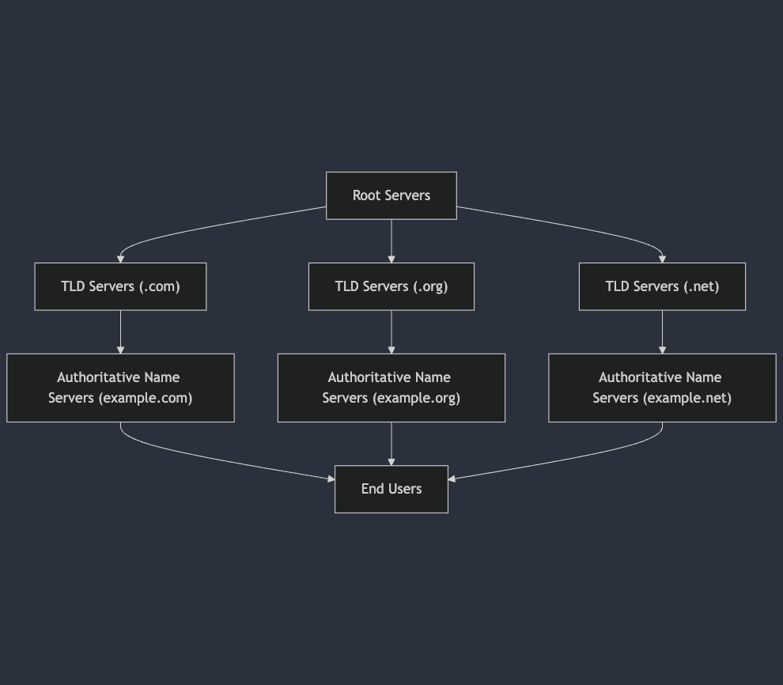
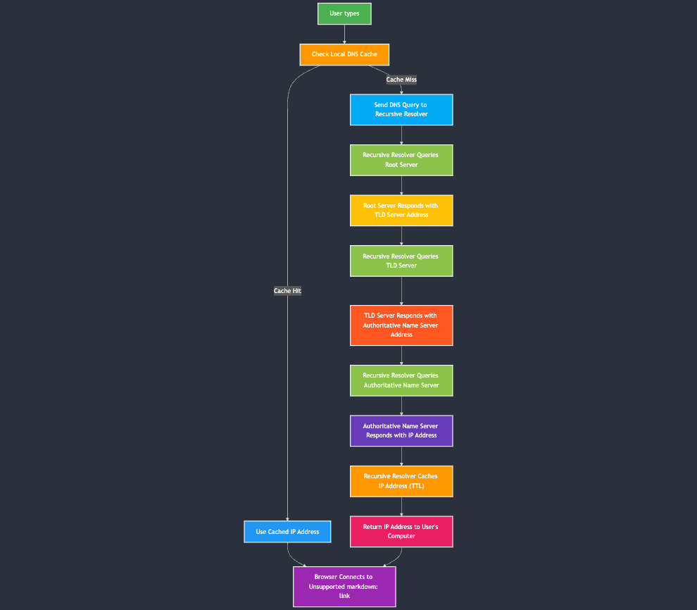

# DNS

## Overview

The Domain Name System (DNS) is a key part of the Internet. It works like a phone book. DNS changes names like `www.example.com` into numbers like `93.184.216.34`. This lesson covers DNS purpose, process, and parts. You will learn how browsers and apps find and connect to servers worldwide.

## Lesson Outcomes

By the end of this lesson, you will be able to:

- **Define DNS:** Explain what DNS is and why it matters.
- **Recognize DNS Parts:** Point out the main parts of DNS: domain names, resolvers, root servers, TLD servers, and name servers.
- **Describe DNS Steps:** Show how a domain name changes to an IP address with recursive and iterative queries.
- **Identify DNS Records:** List common record types (A, AAAA, MX, CNAME, TXT) and their uses.
- **Know DNS Security:** Explain DNS security ideas like DNSSEC and DNS over HTTPS.
- **Understand Caching:** Describe how caching speeds up DNS and lessens the load on servers.

## What is DNS?

DNS is a naming system on the Internet. It is a hierarchical system that is not controlled by one central group. It makes the Web easier by letting people use names instead of numbers to visit sites.

### Key Parts of DNS

1. **Domain Names:**

   - **Definition:** These are names people use to visit sites.
   - **Structure:** They are split by dots. In `www.example.com`, "www" is a subdomain, "example" is the main name, and "com" is the top-level name.

2. **DNS Resolvers:**

   - **Definition:** Also called recursive resolvers.
   - **Function:** They take your request and ask other DNS servers for the IP address.

3. **Root Servers:**

   - **Definition:** The highest level in the DNS hierarchy, responsible for handling and directing DNS queries to the appropriate TLD servers.
   - **Role:** store a list of all Top-Level Domains (TLDs) like ```.com, .org, and .net```, allowing other DNS servers to identify where to send a query for further resolution

4. **TLD Servers:**

   - **Definition:** These servers handle top-level names.
   - **Function:** They guide the query to the right name server.

5. **Authoritative Name Servers:**

   - **Definition:** These servers hold the final DNS records.
   - **Function:** They send the answer with the IP address or other records.

### To better understand the DNS hierarchy, refer to the enhanced domain diagram below:


**Description:**
- Top Level: Root Servers at the top.
- Second Level: TLD Servers (e.g., .com, .org).
- Third Level: Authoritative Name Servers for specific domains (e.g., example.com).
- Bottom Level: End Users making DNS queries.

## The DNS Resolution Process



When you enter a domain name in your browser, the following detailed steps occur:

**Complete DNS Resolution Flow**
1. User Request:
   - Action: You type www.example.com into your browser.
2. Checking Local Cache:
   - Action: Your computer checks its local DNS cache to see if it already knows the IP address for www.example.com.
   - Outcome: If found, it uses the cached IP address. If not, it proceeds to the next step.
3. Querying the Recursive Resolver:

   - Action: Your computer sends a DNS query to a recursive resolver (usually provided by your ISP or a third-party service like Google DNS).
   - Diagram Reference: Arrows showing the query moving from the user to the resolver.
4. Contacting Root Servers:

   - Action: The recursive resolver asks one of the root servers for the IP address of www.example.com.
   - Outcome: The root server responds with the address of the appropriate TLD server (e.g., for .com).
5. Querying the TLD Server:

   - Action: The resolver then queries the TLD server for www.example.com.
   - Outcome: The TLD server provides the address of the authoritative name server for example.com.
6. Contacting the Authoritative Name Server:

   - Action: The resolver sends a query to the authoritative name server for example.com.
   - Outcome: The authoritative server responds with the IP address for www.example.com.
7. Caching the Response:

   - Action: The resolver caches the IP address for future requests based on the Time-To-Live (TTL) value.
   - Benefit: Speeds up subsequent requests and reduces load on DNS servers.
8. Returning the IP Address to the User:

   - Action: The resolver sends the IP address back to your computer.
   - Outcome: Your browser can now connect to www.example.com using the obtained IP address.

## DNS Record Types

DNS records give different details about a domain. Some common types are:

- **A Record:** Links a domain to an IPv4 address.
- **AAAA Record:** Links a domain to an IPv6 address.
- **CNAME Record:** Lets one name be an alias of another.
- **MX Record:** Guides email to the right mail server.
- **TXT Record:** Holds text for email checks and other info.

## Enhancements and Security

DNS is vital. Its safety and privacy are important now.

- **DNSSEC (DNS Security Extensions):**

  - **Purpose:** It signs records to prove they are real.
  - **Benefit:** It helps prevent wrong answers from fake sites.

- **DNS over HTTPS (DoH) and DNS over TLS (DoT):**

  - **Purpose:** They encrypt your DNS requests.
  - **Benefit:** They stop others from spying on your queries.

## The Role of DNS Caching

Caching helps speed up the DNS process:

- **Local Caching:** Your computer or browser may store answers for a set time (Time-To-Live or TTL).
- **Resolver Caching:** Resolvers keep answers to cut down on repeat queries.
- **Benefits:** This lowers delay, network traffic, and stress on bigger DNS servers.
