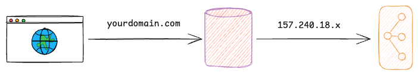

# Domain Name

## Overview
Domain names are an essential part of the internet. They act as simple addresses that help you find web servers. Instead of using hard-to-remember numbers, you use names like www.example.com. This lesson explains domain names, their parts, how to register them, and why they matter.

## Lesson Outcomes

By the end of this lesson, you will be able to:

- **Define a Domain Name:** Explain what a domain name is and why it is useful.
- **Understand the Structure:** Identify parts of a domain name: Top-Level Domains (TLDs), Secondary Level Domains (SLDs), and subdomains.
- **See the Importance:** Understand why we use names instead of IP addresses.
- **Learn the Registration Process:** Check if a domain is free, use registrars, and get a domain name.
- **Know About DNS Refreshing:** Explain how changes spread across DNS servers.
- **Explore Domain Ownership:** Understand that domain names are rented, not owned, and need renewal.

## What is a Domain Name?



A domain name is a word-based address used on the internet. It lets you visit sites without knowing the numeric IP address. For example:

- IPv4 Example: `192.0.2.172`
- IPv6 Example: `2001:db8:8b73:0000:0000:8a2e:0370:1337`

Numbers are hard to remember. Domain names offer a clear and stable alternative.

## Structure of Domain Names
Domain names break into several parts, each set off by a dot. They are read from right to left:

1. **Top-Level Domain (TLD):**
   - **Definition:** The rightmost part, such as .com, .org, .net, .edu, or .gov.
   - **Purpose:** TLDs show the type of site or its location. Examples include:
     - Generic TLDs: .com, .org
     - Country-Code TLDs: .us, .uk, .fr
     - Special TLDs: .edu for schools and .gov for the government.
   - **Note:** A TLD can have up to 63 characters. ICANN keeps a list.

2. **Secondary Level Domain (SLD) / Label:**
   - **Definition:** The part right next to the TLD.
   - **Purpose:** This label shows the name of the business or group, like mozilla in mozilla.org.
   - **Note:** Labels do not care about case. They use letters, numbers, and hyphens. They must start and end with a letter or number.

3. **Subdomains:**
   - **Definition:** Extra labels before the SLD.
   - **Purpose:** Subdomains split a site into parts or services. For example, you might see developer.mozilla.org or support.mozilla.org.

## Why Are Domain Names Important?
- **Easy to Remember:** Domain names replace numbers that are hard to recall.
- **Builds Identity:** A good domain name helps build a brand and shows the site’s purpose.
- **Stays Consistent:** Domain names rarely change even if the IP numbers do.

## Buying and Managing a Domain Name
1. **Ownership vs. Leasing:**
   - **Ownership:** You do not truly own a domain. You pay to use it for a set time.
   - **Registrar:** A registrar is a company that rents domains and keeps their records.

2. **Checking Availability:**
   - **WHOIS Lookup:** Use WHOIS tools to see if a domain is free.  
     Example Command:
     ```bash
     whois example.com
     ```
   - If a domain is taken, you will see the details of its current renter.

3. **Registration Process:**
   - **Steps:**
     - Visit a registrar’s site.
     - Use their search tool to check the name.
     - Fill in the form with correct details.
     - Pay and wait as the new domain updates on DNS servers.

4. **DNS Propagation and Refreshing:**
   - When you register or change a domain, updates spread to many DNS servers.
   - Each server holds the info for a set time (TTL). During this time, some may show old data.

## Additional Considerations
- **Legal and Admin Matters:** Some domains need proof of eligibility, especially government or education sites.
- **Changing System:** New TLDs come up over time and rules may change.
