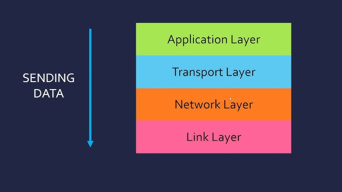
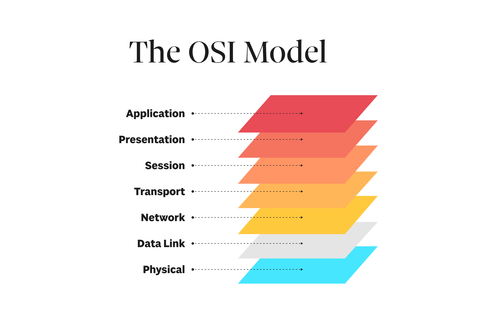

# A Beginner's Crash Course on Networking

## Overview

Networking has changed the way we live. What began as a way to connect a few devices has grown into a system that powers our daily tech use. Today, networking supports home automation, artificial intelligence, and smart gadgets. This guide will give you an easy introduction to networking basics. You will learn about the Internet’s origins, its key parts, and the main protocols used in networks.

 

## Learning Objectives

By the end of this lesson, you will be able to:

1. Name and describe the main parts of the Internet.
2. Understand what happens when data is sent through a network.
3. Explain the roles of forwarding and routing.
4. Describe the layers of the TCP/IP (Transmission Control Protocol/Internet Protocol) stack.

 

## A Quick Guide to Networking

Networking allows devices to talk to each other. Think of it as a system of roads where cars (data packets) move from one place to another. When you send a message or watch a video online, data travels along these routes until it gets to you.

### Major Parts of the Internet

The Internet is built from many parts that work together. Let’s look at the main components.

#### 1. The Network Edge

This is where people and their devices connect to the Internet. Data is created, shared, and received at the network edge.

- **End Devices:**  
  These are the items you use every day. Computers, smartphones, tablets, and smart sensors fall under this group. They let you send and get information.

- **Access Networks:**  
  These networks connect end devices to the bigger Internet. Examples include DSL, cable, fiber optics, Wi-Fi, and mobile connections. Each offers a different speed and range.
  
  - **Home Access Networks:**  
    In homes, these networks let you connect multiple devices. They help you share the Internet with family members.
    
  - **Institutional Access Networks:**  
    Companies and schools use these networks to link many computers. They help run office work and classroom activities.
    
  - **Mobile Access Networks:**  
    These cover smartphones and other moving devices. They support wireless data transfer on the go.

#### 2. The Network Core

Deep in the network, data moves between devices through two key processes: forwarding and routing.

- **Forwarding:**  
  Forwarding moves data from one device to the next. Think of it as a guide who gives directions at each step.

- **Routing:**  
  Routing plans the best route for the data. It is similar to picking the shortest road for a delivery.

**How Forwarding and Routing Work:**

1. **Packet Arrival:**  
   A device gets a data packet. It looks at the destination address.
2. **Making a Decision:**  
   The device checks its table to see where to send the packet next.
3. **Passing the Packet:**  
   The packet is sent to the next device on the route.
4. **Repeat:**  
   This process continues until the packet reaches its end point.

### Network Protocols

#### The TCP/IP Stack

The TCP/IP stack is a set of rules that help devices talk to each other. It is the main way data moves around the Internet.

**Layers of the TCP/IP Stack:**

1. **Application Layer:**  
   This layer is where you interact with the network. Web browsers, email, and file transfers use this layer with protocols like HTTP, SMTP, and FTP.
2. **Transport Layer:**  
   This layer makes sure that data goes from one place to another. It uses TCP for reliable delivery and UDP for quicker, simpler transfers.
3. **Internet (Network) Layer:**  
   This layer handles the addressing and routing of data. It uses IP (either IPv4 or IPv6) to find the right path.
4. **Link (Network Access) Layer:**  
   This layer deals with the actual physical transfer of data. It uses protocols like Ethernet and Wi-Fi to manage connections on local networks.

 

## The OSI Model
While the TCP/IP stack is widely used, the OSI model provides a more detailed framework for understanding network interactions. The OSI (Open Systems Interconnection) model divides networking processes into seven distinct layers, each with specific functions. Understanding the OSI model can help you grasp how different technologies and protocols operate and interact within a network.

### Layers of the OSI Model:

Source: https://sparkbox.com/foundry/what_are_the_7_layers_of_the_OSI_model_network_of_communication

1. **Layer 1: Physical Layer**
   - Function: Transmits raw bitstreams over a physical medium.
   - Examples: Cables, switches, hubs, electrical signals, optical signals.
2. **Layer 2: Data Link Layer**
   - Function: Handles error detection and correction from the physical layer. It manages node-to-node data transfer.
   - Examples: MAC addresses, Ethernet, Wi-Fi, switches.
3. **Layer 3: Network Layer**
   - Function: Determines how data is sent to the receiving device. It handles logical addressing and routing.
   - Examples: IP addressing, routers, Layer 3 switches.
4. **Layer 4: Transport Layer**
   - Function: Provides reliable data transfer services to the upper layers. It ensures complete data transfer.
   - Examples: TCP, UDP, port numbers.
5. **Layer 5: Session Layer**
   - Function: Manages sessions or connections between applications. It handles opening, closing, and managing sessions.
   - Examples: NetBIOS, PPTP, RPC.
6. **Layer 6: Presentation Layer**
   - Function: Translates data between the application layer and the network. It handles data encryption and compression.
   - Examples: SSL/TLS, JPEG, MPEG.
7. **Layer 7: Application Layer**
   - Function: Provides network services directly to user applications. It interfaces with software applications to implement a communicating component.
   - Examples: HTTP, FTP, SMTP, DNS.

## Final Thoughts

This guide has given you a quick look into the basics of networking. You learned about the history of the Internet, how data moves, and the parts that make up the network. You also saw the main layers of the TCP/IP stack and why they matter. 

By understanding these ideas, you will see how the Internet connects our devices and fuels modern tools. You now have a strong start on your journey into the world of networks. Enjoy your learning, and keep exploring the basics that power our connected world!
