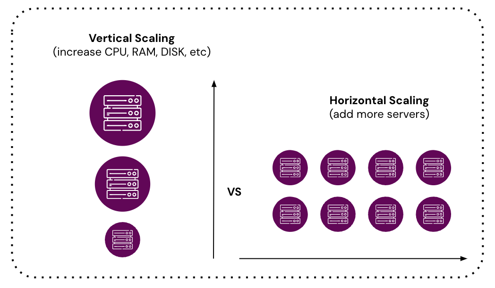
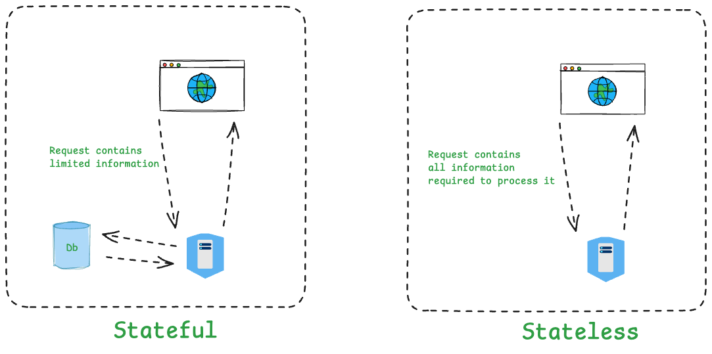
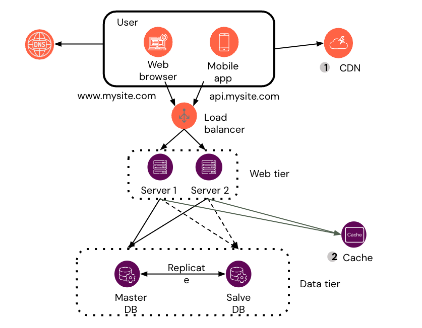
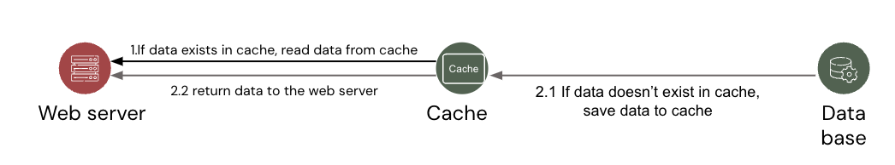

# Introduction to Scalability

## Overview
Scaling is key when apps gain more users and data. As usage grows, keeping up with demands is a must. This guide covers the basics of scaling web and mobile apps. You will learn how to add capacity and spread the load. We cover two scaling methods, explain app state, talk about load balancers, and show how caching helps. We also look at ways to handle server problems with backup plans. This guide gives you the tools to build strong, scalable apps.

## Lesson Outcomes
By the end of this lesson, you will:
- **Compare Scaling Techniques:**
  - Know the differences between vertical and horizontal scaling.
  - Understand how each method affects your system.
- **Manage App State:**
  - Learn the key differences between stateless and stateful apps.
  - Decide which approach works best for your app.
- **Explain Load Balancing:**
  - Understand why you need load balancing to share traffic.
  - See examples like Nginx and Azure Load Balancer.
- **Learn Caching Basics:**
  - Discover how caching makes apps faster.
  - Recognize tools like Redis and Memcached.
  - See how CDNs bring data closer to users.
- **Implement Fault Tolerance and High Availability:**
  - Learn ways to keep apps working even when a server fails.
  - Know the basics of replication, backups, and failure handling.

---

## 1. Introduction to Scaling

Scaling helps an app support more users and data without losing performance. There are two basic methods: vertical and horizontal scaling.

### Vertical Scaling vs. Horizontal Scaling

#### Vertical Scaling
Vertical scaling means adding more power to a single server. This can mean extra CPU, memory, or storage. This method is simple to set up. You do not need to change the app. The downside is a limit exists for how much you can improve one machine. This method can also cause a single point of failure.

#### Horizontal Scaling
Horizontal scaling means adding more machines or servers. With this method, you share the load across many servers. Adding more servers can boost performance and help handle spikes in traffic. It also reduces the risk of a single machine failing. However, this method often requires changes in how your app works. You will need load balancers and tools to manage data spread across servers.

### Stateless vs. Stateful Applications

#### Stateless Applications
Stateless apps do not store user session data between requests. Every request stands on its own. This makes it easy to use any server to handle a request. Stateless designs help with horizontal scaling. They also make load balancing simpler because any server can take over a request.

#### Stateful Applications
Stateful apps hold on to session data or user information. Think of a shopping cart that remembers what you picked. These apps need extra steps to share data between servers. This can include using shared databases or keeping the user on one server. This may add extra work when you scale your app.

---

## 2. Load Balancing

Load balancing spreads user requests across several servers. This helps each server work within its capacity. The result is a smoother experience for users. Load balancing stops one machine from being overwhelmed and helps your app run all the time.

### Purpose and Benefits
The main aim of load balancing is to direct traffic evenly. It stops one server from taking too many jobs. A well-balanced system gives better performance and more uptime. The load balancer sends work away from servers that show problems.

### Common Load Balancers
Some popular load balancers include:
- **Nginx:** An open-source tool that works as both a reverse proxy and a load balancer.
- **Azure Load Balancer:** A cloud service that distributes traffic among Azure Virtual Machines.

### How Load Balancers Work
Load balancers use simple methods to decide where traffic goes. Some common methods are:
- **Round Robin:** Servers take turns handling each new request.
- **Least Connections:** The server with the fewest active links gets the next request.
- **IP Hashing:** The client’s IP address helps choose the server.
These methods help your app work fast and avoid server overload.

---

## 3. Caching Basics

Caching stores copies of data in fast storage. This reduces the need to ask the main server or compute answers over and over. Good caching cuts down on wait times and lifts the load on your main system.

### Why Caching Matters
When data is cached, it is pulled from a faster source instead of a slow database. This keeps your app responsive and lowers server strain. Caches are essential in apps that handle many requests.

### Popular Caching Systems
Tools such as Redis and Memcached help with caching:
- **Redis:** An in-memory tool that holds data for quick access. It can also act as a simple database and message tool.
- **Memcached:** A fast, distributed cache. It helps speed up web apps by reducing repeated work on databases.

#### CDN (Content Delivery Network) Overview
A CDN is a network of servers spread over different areas. These servers store copies of static files like images and videos. When a user requests a file, the CDN sends it from the server nearest to them. This lowers delay and helps your app run smoother.

---

## 4. Fault Tolerance and High Availability

Your app must keep running even when some parts fail. Fault tolerance and high availability are methods to meet this need.

### Fault Tolerance
Fault tolerance means your system can work even if some parts stop. You do this by adding backup systems and spread-out data. The goal is to avoid one single point of failure. This means if one server goes down, others pick up the load.

### Key Strategies
- **Replication:** Copy data on multiple servers. This way, if one copy fails, another is ready.
- **Backups:** Regularly save data. Backups help restore your system after a major problem.

### High Availability
High availability means your app remains reachable almost all the time. You plan for quick recovery when issues occur. Using multiple servers and data backups keeps your service running, even during repairs or failures.

---

### Review the content several times to build a strong foundation.

[Designing Applications for Millions of Users](https://bytebytego.com/courses/system-design-interview/scale-from-zero-to-millions-of-users)

## Suggested Reading

To build on what you have learned, try these resources:

### Books
- **"Designing Data-Intensive Applications" by Martin Kleppmann**  
  This book explains how to build apps that run well with large amounts of data.
- **"Web Scalability for Startup Engineers" by Artur Ejsmont**  
  This book gives clear tips on handling scaling challenges in web apps.
- **"Azure for Architects" by Ritesh Modi**  
  This book provides insights into building scalable and resilient applications on Azure.

### Online Articles and Guides
- **Azure Architecture Blog:**  
  Check case studies and articles on building scalable apps with Azure.
- **NGINX Blog:**  
  Find posts on load balancing and improving web performance.

### Tutorials and Courses
- **Coursera: Scalable Web Applications**  
  This course covers strategies for making apps that scale.
- **Udemy and [Pluralsight Courses](https://www.pluralsight.com/)**  
  See courses on cloud setup, caching, and distributed systems.

### Documentation
- **Redis Documentation:**  
  Visit Redis.io for guides and tips on using Redis.
- **NGINX Documentation:**  
  Read the NGINX guides for help with load balancing and server tuning.
- **Azure Load Balancer Documentation:**  
  Find detailed advice on using Azure Load Balancer effectively.

---
