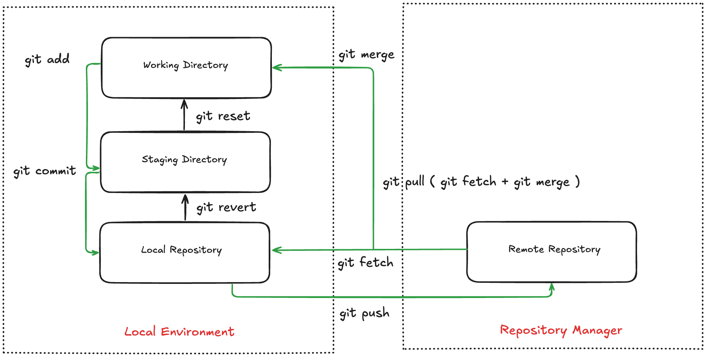

# Introduction to Git

## Lesson Overview

This lesson will introduce you to Git, a tool that helps you track and store changes in your files. You will learn key ideas, the main terms used in Git, and a simple way to start using it.

 

## Learning Objectives

By the end of this lesson, you will be able to:

1. Understand the need for version control systems.
2. Identify key Git terms like repos, branches, push, pull, and more.
3. Recognize different Git directories.
4. Set up a repository and run through basic Git commands to save and share your work.

 

## The Lesson

### What Is a Version Control System?

A version control system (VCS) tracks changes made to your files over time. It records who changed what and when. This helps teams work on projects without confusion. A VCS keeps a history of every change to code, documents, and even build scripts. It is a must-have tool when several people work on the same project.

### An Introduction to Git

Git is a popular VCS used to manage code. It helps you keep track of changes in your files and allows multiple team members to work on a project without losing track of updates. Each person gets a complete copy of the project so they can work even when offline. Here are the basics:

**1. Version Control:** Git tracks every change. It shows who made a change and when.

**2. Distributed System:** Each user has a full copy of the repository. This makes offline work possible and reduces wait times for network access.

**3. Repository (Repo):** A repo is a storage space for your project files and history. It holds every version of every file.

**4. Commit:** A commit saves a set of changes as a snapshot. It has a unique identifier and a short message that describes the change.

**5. Branches:** Branches let you try new ideas without changing the main code. You create a separate branch for new features or bug fixes.

**6. Merge:** Merging combines changes from one branch into another. It lets you bring your work into the main project after testing it.

**7. Pull Request (PR):** A pull request is a way to ask your teammates to review your changes before they become part of the main project.

**8. Remote:** A remote repository is stored on a server online. GitHub, GitLab, and Bitbucket are examples of remote hosting.

**9. Clone:** Cloning lets you create a local copy of a remote repo. This copy is used to work on your project offline.

**10. Push and Pull:** Pushing sends your local commits to the remote repo. Pulling gets any changes from the remote repo to your local copy.

#### Basic Git Flow

Git works with three main directories:

1. **Working Directory:** This is where you make edits to your files.
2. **Staging Area:** Here, you list the files you plan to include in your next commit.
3. **Local Repository:** This stores all the committed changes on your computer. Later, you can send these changes to a remote repository.

Below is a diagram to show you the flow:

To use Git, follow these steps:

**1. Initialize a Repository:**  
For a new project, run `git init`. If you want to copy an existing repo, use `git clone <URL>`.

**2. Edit Files:**  
Work in your files in the working directory.

**3. Stage Changes:**  
Add your changes with `git add <filename>` or `git add .` to stage all files.

**4. Commit Changes:**  
Save your changes by running `git commit -m "commit message"`.

**5. Push to Remote:**  
Send your commits to the online repo with `git push`.

**6. Fetch from Remote:**  
Run `git fetch` to download new changes from the remote repo without merging them.

**7. Pull from Remote:**  
Use `git pull` to download and merge new changes into your working directory.

**8. Merge Code:**  
Merge fetched changes into your project to keep your work updated.

Watch this short crash course on [Git](https://youtu.be/tz82ola3oy0) to see these commands in action.

This lesson gives you a clear start with Git. Practice the steps and commands to feel more secure with using Git. Enjoy your journey into version control!
