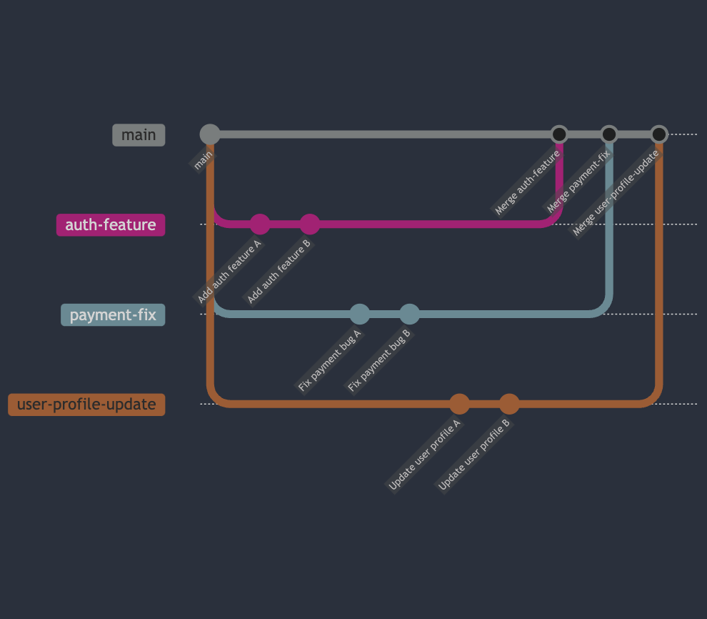
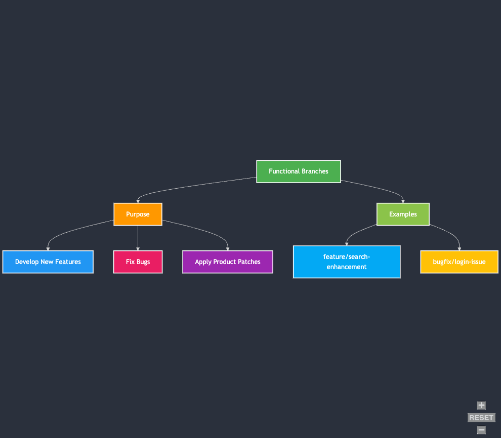
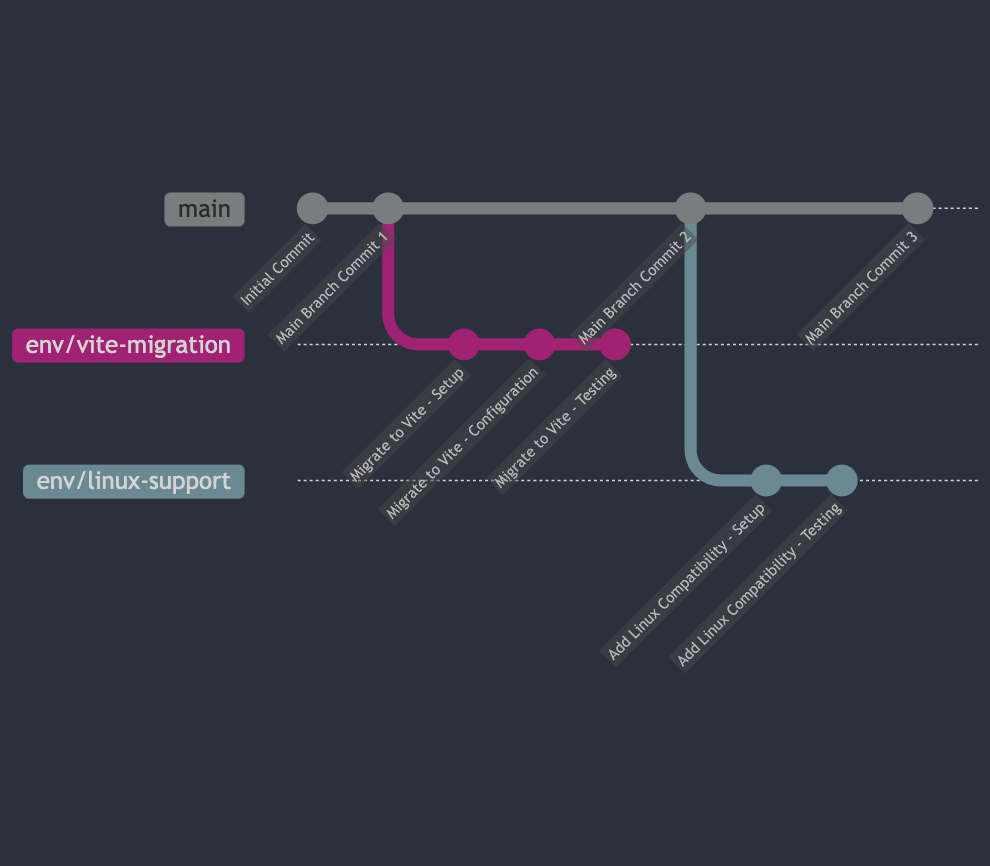
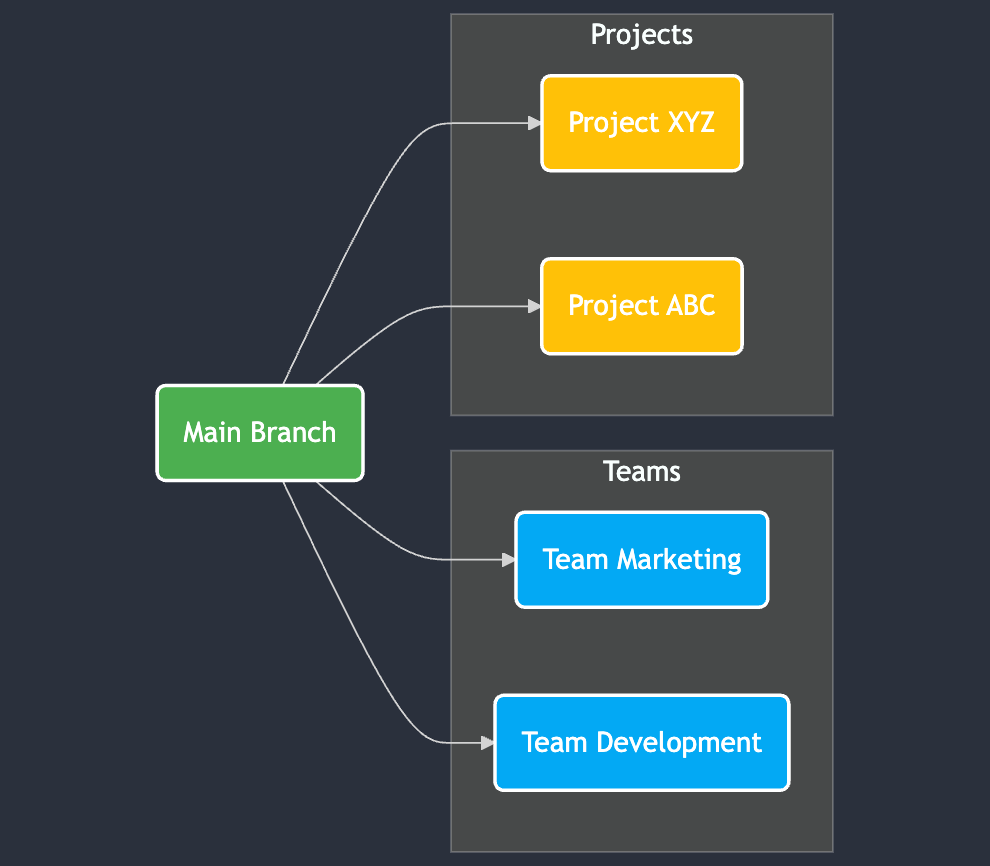
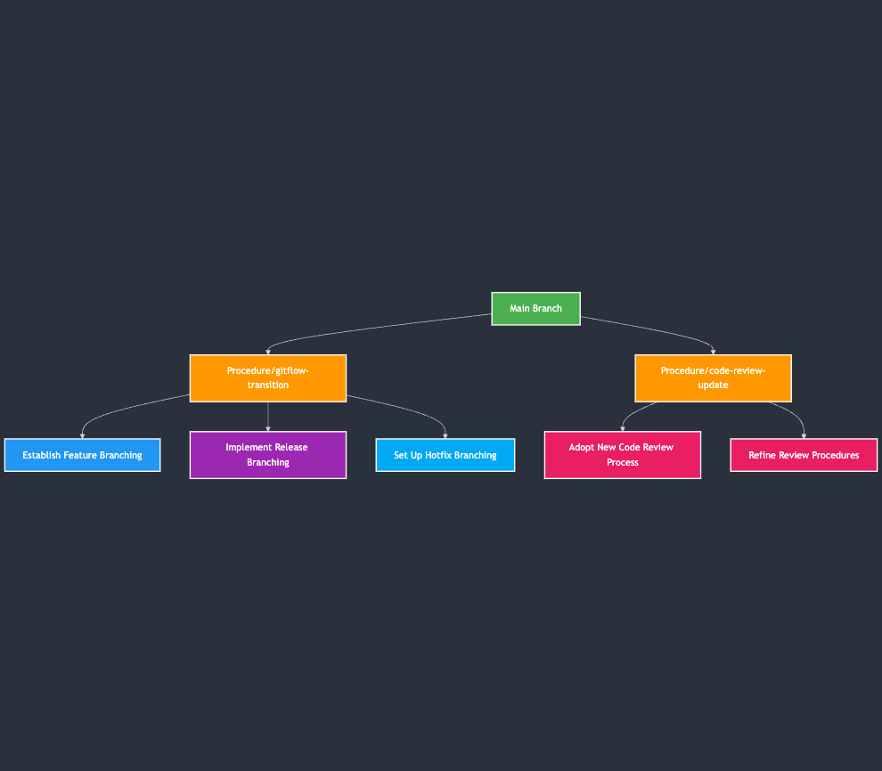

<!-- # Git Branching -->

## Overview 

In this lesson, you will learn how to use branches in Git to improve teamwork. We will show you how to create and work in separate branches and later merge your work with the main branch. This approach makes version control clearer and helps avoid conflicts.

<br>

## Learning Objectives

By the end of this lesson, you will be able to:

1. Explain why branches matter in Git.
2. Recognize branching in physical, functional, environmental, organizational, and procedural areas.
3. Create a new branch in Git.
4. Make changes, stage them, and then commit in a branch.

<br>

## The Lesson

### Branching

In a team setting, developers often work on different branches. A branch is a copy of a baseline taken from the project. It works like the original but lets you experiment or work on features without disturbing the main code. With branches, you can develop several tasks at once.

**Branches** help you work on new features or fixes without risking the main branch. They also let you work on parts of the project based on file structure, new functions, or other code segments. People use branches for many reasons. 

Here are some examples and the use cases:

### 1. Physical
You create branches for files and components. This keeps parts separate.

Example - 

**Explanation**

- **Main Branch:**
   - The starting point of the repository where the stable codebase resides.

- **Feature Branches:**
   - **`auth-feature` Branch:**
     - Created to develop new authentication functionalities.
     - Commits like "Add auth feature A" and "Add auth feature B" represent incremental changes specific to authentication.
   
   - **`payment-fix` Branch:**
     - Dedicated to addressing bugs and improvements in the payment processing module.
     - Commits such as "Fix payment bug A" and "Fix payment bug B" ensure that payment-related issues are handled separately.
   
   - **`user-profile-update` Branch:**
     - Focused on enhancing user profile features.
     - Commits like "Update user profile A" and "Update user profile B" capture changes related to user profiles.

- **Merging Back to Main:**
   - After the development and testing in each feature branch are complete, the branches are merged back into the `main` branch.
   - This ensures that the main codebase is updated with the latest features and fixes without the branches interfering with each other during development.


### 2. Functional:
 You design branches for new features. They also work well for bug fixes and product patches.

 Example



 **Explanation**

- Functional Branches
   - Purpose
      - Develop New Features: Creating branches to add new functionalities to the project.
      - Fix Bugs: Isolating bug fixes in separate branches to maintain stability.
      - Apply Product Patches: Implementing patches without affecting the main codebase.
   - Examples
      - ```feature/search-enhancement```
         - Description: Adds new search functionality to the application.
      - ```bugfix/login-issue```
         - Description: Fixes a critical bug in the login process.

### 3. Environmental
Branches can match changes in build tools or run-time platforms like compilers or operating systems.

Example



 **Explanation**

- Initial Commits:
  - Initial Commit: The starting point of the repository.
  - Main Branch Commit 1: Ongoing development in the `main` branch.

- Environmental Branches:
  - `env/vite-migration`:
    - Migrate to Vite - Setup: Initial setup for migrating from Webpack to Vite.
    - Migrate to Vite - Configuration: Configuring Vite settings.
    - Migrate to Vite - Testing: Testing the new build tool to ensure stability.
  
  - `env/linux-support`:
    - Add Linux Compatibility - Setup: Setting up the environment for Linux compatibility.
    - Add Linux Compatibility - Testing: Testing the application on Linux to ensure compatibility.

- Main Branch Continuation:
  - Main Branch Commit 2: Further developments and updates.
  - Main Branch Commit 3: Continued maintenance and updates.

### 4. Organizational:
 Use branches for different teams or projects. Each group has its own space to work.

 Example
 

**Explanation**

- **Main Branch:** Represents the stable version of the codebase.
- **Team Marketing Branch:** Dedicated branch for the Marketing team to work on marketing-related features or content.
- **Team Development Branch:** Dedicated branch for the Development team to handle core development tasks.
- **Project XYZ Branch:** Specific branch for Project XYZ, allowing focused development without affecting other projects.
- **Project ABC Branch:** Another project-specific branch for Project ABC.


### 5. Procedural
Branches support different team rules and workflows. They keep work separate during transitions.

Example


**Explanation**

- Main Branch
  - The central branch from which procedural branches diverge.

- Procedure/gitflow-transition
  - Purpose:** Transition from traditional Git workflow to Gitflow.
  - Sub-branches:
    - Establish Feature Branching: Define how new features will be developed.
    - Implement Release Branching: Set up branches for managing releases.
    - Set Up Hotfix Branching: Create branches for urgent fixes.

- Procedure/code-review-update**
  - Purpose: Adopt and refine a new code review process.
  - Sub-branches:
    - Adopt New Code Review Process: Implement the new review guidelines.
    - Refine Review Procedures: Continuously improve the review workflow.


#### Creating Branches with Git

Follow these steps to create and use a branch in Git:

1. Open your terminal and run:  
   `git checkout -b <NEW_BRANCH_NAME>`  
   This command makes a new branch and switches to it.

2. Work on your code. Make changes in the files you need to update.

3. When you are ready, use `git add` to stage your changes and then use `git commit` to save your work. 

4. Push your branch to the remote repository using:  
   `git push -u origin <NEW_BRANCH_NAME>`

5. When your work is tested and complete, merge your branch with the main branch either on your system or via a pull request on GitHub.

We will explore more about branch management and real challenges during code delivery in our bootcamp sessions.


