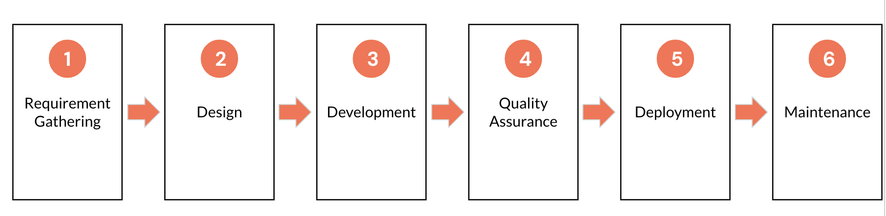
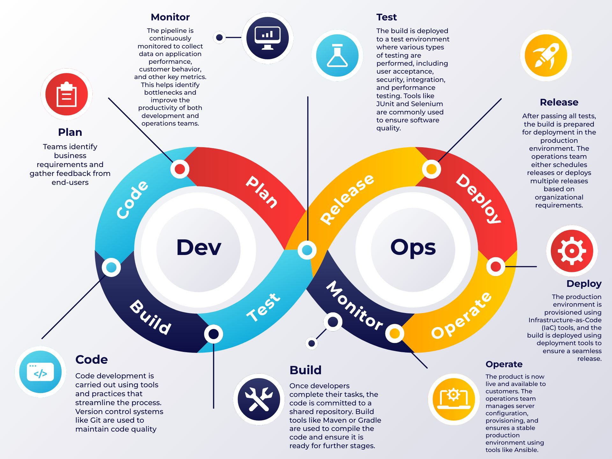

# Introduction to DevOps

## Overview

DevOps is a set of best practices, tools, and, most importantly, a cultural philosophy that fosters seamless integration and automation across the entire software development lifecycle. DevOps bridges the gap between software development (Dev) and IT operations (Ops), focusing on delivering continuous, high-quality products efficiently and within shorter timeframes.

## Lesson Outcomes

By the end of this lesson, you will be able to:

1. Explain the traditional software delivery approach (Waterfall Model).
2. Identify the challenges associated with the traditional approach.
3. Describe the Agile methodology for software delivery.
4. Define DevOps and its core principles.
5. Outline the stages of the DevOps lifecycle.

## Explanation 

### Traditional approach to Software Development (Waterfall Model)

The Waterfall model is a sequential software development approach where each phase (requirements, design, implementation (development), testing, deployment, and maintenance) is completed fully before moving to the next. It is best suited for projects with well-defined, stable requirements and minimal scope for changes during development.

**Requirements Gathering:**
The process begins with collecting and documenting all software requirements in detail, including functional and non-functional needs, constraints, and assumptions.

**System Design:**
Once the requirements are clear, the system's architecture and design are planned. This phase involves creating high-level and detailed designs, such as database schemas, software architecture, and user interface layouts.

**Implementation:**
With the design finalized, the development team begins coding the software according to the specifications outlined during the design phase.

**Testing:**
After coding is complete, the software undergoes thorough testing to ensure it meets the requirements and functions as intended. This includes various testing types like unit, integration, system, and user acceptance testing.

**Deployment:**
Once testing is complete and the software is approved, it is deployed to the production environment or delivered to end-users.

**Maintenance:**
Post-deployment, the software enters the maintenance phase, where any bugs or issues are addressed. This phase may also involve updates or enhancements to keep the software relevant and functional.

### When to use Waterfall Model?

The Waterfall model is best suited for projects where:

- Requirements are well understood and unlikely to change during development.
- The project scope is stable and well-defined.
- Deliverables and timelines are clearly outlined upfront.

### Challenges Faced in traditional software development

1. Flexibility: The Waterfall model follows a rigid, sequential approach, making it difficult to adapt to changing requirements once development has begun.

2. Delayed Feedback: Users and stakeholders typically see the final product only at the end, which means any issues or mismatched expectations are discovered too late.

3. Long Delivery Cycles: Development cycles are lengthy, delaying the time it takes to deliver working software and slowing down the return on investment.

4. Risk of Failure: A single issue in any phase can disrupt the entire project, increasing the chances of failure.

5. Limited Collaboration: Teams in Waterfall often work in silos, leading to communication gaps between developers, testers, and business stakeholders.

6. Quality Concerns: Testing is done only after the development phase, which means bugs or defects identified late are expensive and time-consuming to fix.

7. Difficulty in Managing Uncertainty: Waterfall assumes all requirements are clear and unchanging from the start, which is rarely the case in real-world projects.

### Goal of a Dev and Ops Team in traditional approach 

- The goal of the Development Team in traditional approach is to delivery software faster and the Operations team is responsible for maintaining stability.

- Faster delivery leads to deploying multiple changes to the production frequently and hence brings instability.

- Operations Team resist these changes to maintain Stability.

### Agile way of Software Delivery

#### What Agile is not:

- A Methodology: Agile is not a strict set of rules or procedures to follow.

- A Specific Way of Software Development: It is not tied to a single technique or development approach.

- A Framework: Agile is not limited to frameworks like Scrum or Kanban—it is a broader mindset.

- A Rigid Process: Agile is flexible and adapts to the needs of the team and project, rather than being a predefined process.

#### What is Agile?

- Agile is a Mindset: It’s a way of thinking that focuses on adaptability, collaboration, and continuous improvement.

- Agile is a Way of Working: It emphasizes flexibility, teamwork, and delivering value incrementally.

- Agile is a Set of Values and Principles: Rooted in the Agile Manifesto, it guides how teams approach work to ensure efficiency, quality, and customer satisfaction.

### Goal of Agile way of Software delivery

- The goal of the Agile way of Software Delivery is to deliver useful, working software to users as quickly as possible. Speed matters because delays mean missed opportunities, and you can only start benefiting once the software is released.
- Quality is key to making the software valuable for users.
- To achieve both speed and quality, we need to release software frequently and use automation to keep the process efficient.

### What is DevOps?

> Dev(elopement) + Op(eration)s

DevOps are set of practices that brings the Development team and Operations team together instead of working in silos.

DevOps aims to shorten the software development life cycle and provide continuous delivery with high software quality and inline with business objective.

### DevOps Lifecyle

1. Plan: Teams identify business requirements and gather feedback from end-users. A project roadmap is created to maximize business value and guide the delivery of the desired product.

2. Code: Code development is carried out using tools and practices that streamline the process. Version control systems like Git are used to maintain code quality and prevent security flaws or poor coding practices.

3. Build: Once developers complete their tasks, the code is committed to a shared repository. Build tools like Maven or Gradle are used to compile the code and ensure it is ready for further stages.

4. Test: The build is deployed to a test environment where various types of testing are performed, including user acceptance, security, integration, and performance testing. Tools like JUnit and Selenium are commonly used to ensure software quality.

5. Release: After passing all tests, the build is prepared for deployment in the production environment. The operations team either schedules releases or deploys multiple releases based on organizational requirements.

6. Deploy: The production environment is provisioned using Infrastructure-as-Code (IaC) tools, and the build is deployed using deployment tools to ensure a seamless release.

7. Operate: The product is now live and available to customers. The operations team manages server configuration, provisioning, and ensures a stable production environment using tools like Chef.

8. Monitor: The pipeline is continuously monitored to collect data on application performance, customer behavior, and other key metrics. This helps identify bottlenecks and improve the productivity of both development and operations teams.

## Suggested Reading

[What is DevOps?](https://www.atlassian.com/devops)

[A Complete Guide on DevOps](https://www.uptut.com/tutorial/introduction-to-devops)