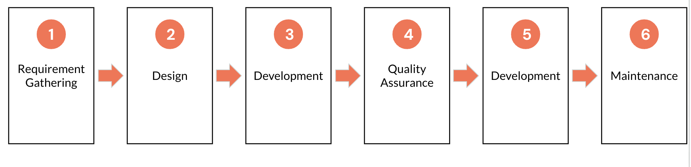
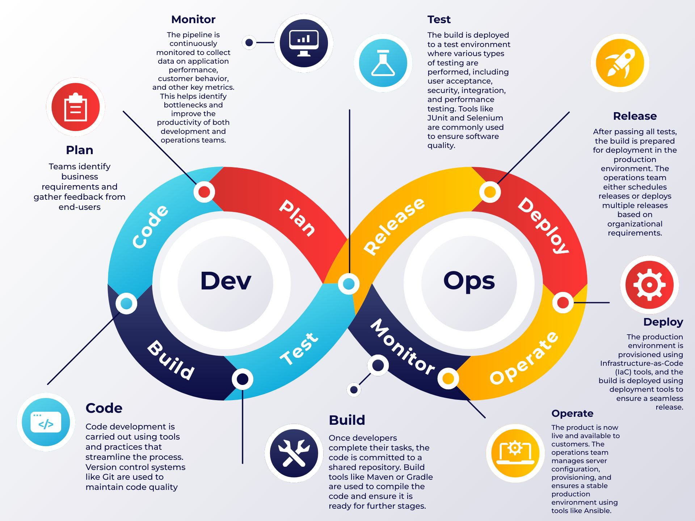
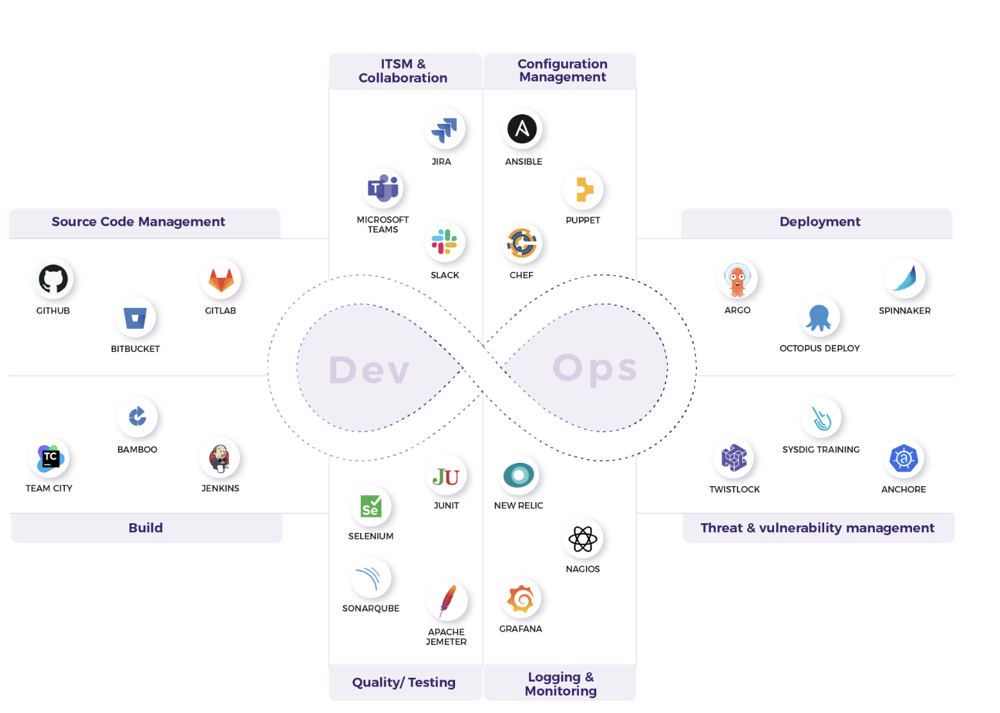
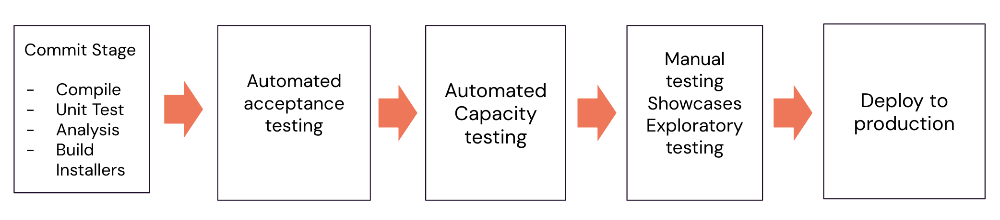
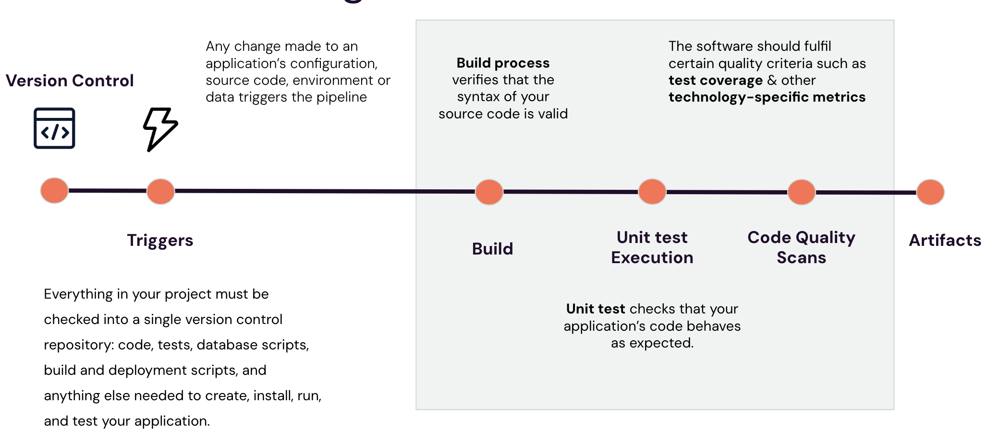
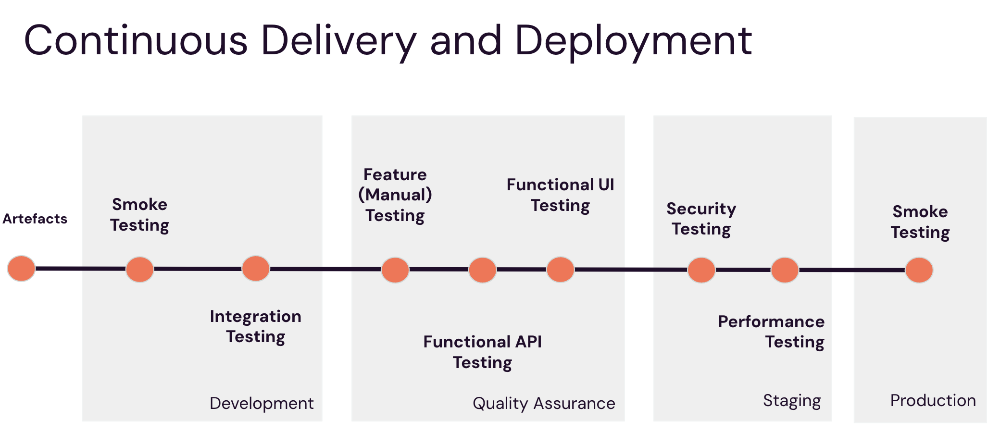

# Introduction to DevOps

## Overview

DevOps is a set of best practices, tools, and, most importantly, a cultural philosophy that fosters seamless integration and automation across the entire software development lifecycle. DevOps bridges the gap between software development (Dev) and IT operations (Ops), focusing on delivering continuous, high-quality products efficiently and within shorter timeframes.

## Lesson Outcomes

By the end of this lesson, you will be able to:

1. Explain the traditional software delivery approach (Waterfall Model).
2. Identify the challenges associated with the traditional approach.
3. Describe the Agile methodology for software delivery.
4. Define DevOps and its core principles.
5. Outline the stages of the DevOps lifecycle.
6. Understand Continuous Integration, Continuous Delivery, and Continuous Deployment.
7. Explore the concepts of Containerization and Orchestration.
8. Learn the principles of Infrastructure as Code (IaC).
9. Understand the importance of Observability and Monitoring in modern software systems.

## Explanation 

### Traditional approach to Software Development (Waterfall Model)

The Waterfall model is a sequential software development approach where each phase (requirements, design, implementation (development), testing, deployment, and maintenance) is completed fully before moving to the next. It is best suited for projects with well-defined, stable requirements and minimal scope for changes during development.

**Requirements Gathering:**
The process begins with collecting and documenting all software requirements in detail, including functional and non-functional needs, constraints, and assumptions.

**System Design:**
Once the requirements are clear, the system's architecture and design are planned. This phase involves creating high-level and detailed designs, such as database schemas, software architecture, and user interface layouts.

**Implementation:**
With the design finalized, the development team begins coding the software according to the specifications outlined during the design phase.

**Testing:**
After coding is complete, the software undergoes thorough testing to ensure it meets the requirements and functions as intended. This includes various testing types like unit, integration, system, and user acceptance testing.

**Deployment:**
Once testing is complete and the software is approved, it is deployed to the production environment or delivered to end-users.

**Maintenance:**
Post-deployment, the software enters the maintenance phase, where any bugs or issues are addressed. This phase may also involve updates or enhancements to keep the software relevant and functional.

### When to use Waterfall Model?

The Waterfall model is best suited for projects where:

- Requirements are well understood and unlikely to change during development.
- The project scope is stable and well-defined.
- Deliverables and timelines are clearly outlined upfront.

### Challenges Faced in traditional software development

1. Flexibility: The Waterfall model follows a rigid, sequential approach, making it difficult to adapt to changing requirements once development has begun.

2. Delayed Feedback: Users and stakeholders typically see the final product only at the end, which means any issues or mismatched expectations are discovered too late.

3. Long Delivery Cycles: Development cycles are lengthy, delaying the time it takes to deliver working software and slowing down the return on investment.

4. Risk of Failure: A single issue in any phase can disrupt the entire project, increasing the chances of failure.

5. Limited Collaboration: Teams in Waterfall often work in silos, leading to communication gaps between developers, testers, and business stakeholders.

6. Quality Concerns: Testing is done only after the development phase, which means bugs or defects identified late are expensive and time-consuming to fix.

7. Difficulty in Managing Uncertainty: Waterfall assumes all requirements are clear and unchanging from the start, which is rarely the case in real-world projects.

### Goal of a Dev and Ops Team in traditional approach 

- The goal of the Development Team in traditional approach is to delivery software faster and the Operations team is responsible for maintaining stability.

- Faster delivery leads to deploying multiple changes to the production frequently and hence brings instability.

- Operations Team resist these changes to maintain Stability.

### Agile way of Software Delivery

#### What Agile is not:

- A Methodology: Agile is not a strict set of rules or procedures to follow.

- A Specific Way of Software Development: It is not tied to a single technique or development approach.

- A Framework: Agile is not limited to frameworks like Scrum or Kanban—it is a broader mindset.

- A Rigid Process: Agile is flexible and adapts to the needs of the team and project, rather than being a predefined process.

#### What is Agile?

- Agile is a Mindset: It’s a way of thinking that focuses on adaptability, collaboration, and continuous improvement.

- Agile is a Way of Working: It emphasizes flexibility, teamwork, and delivering value incrementally.

- Agile is a Set of Values and Principles: Rooted in the Agile Manifesto, it guides how teams approach work to ensure efficiency, quality, and customer satisfaction.

### Goal of Agile way of Software delivery

- The goal of the Agile way of Software Delivery is to deliver useful, working software to users as quickly as possible. Speed matters because delays mean missed opportunities, and you can only start benefiting once the software is released.
- Quality is key to making the software valuable for users.
- To achieve both speed and quality, we need to release software frequently and use automation to keep the process efficient.

### What is DevOps?

> Dev(elopement) + Op(eration)s

DevOps are set of practices that brings the Development team and Operations team together instead of working in silos.

DevOps aims to shorten the software development life cycle and provide continuous delivery with high software quality and inline with business objective.

### DevOps Lifecyle

1. Plan: Teams identify business requirements and gather feedback from end-users. A project roadmap is created to maximize business value and guide the delivery of the desired product.

2. Code: Code development is carried out using tools and practices that streamline the process. Version control systems like Git are used to maintain code quality and prevent security flaws or poor coding practices.

3. Build: Once developers complete their tasks, the code is committed to a shared repository. Build tools like Maven or Gradle are used to compile the code and ensure it is ready for further stages.

4. Test: The build is deployed to a test environment where various types of testing are performed, including user acceptance, security, integration, and performance testing. Tools like JUnit and Selenium are commonly used to ensure software quality.

5. Release: After passing all tests, the build is prepared for deployment in the production environment. The operations team either schedules releases or deploys multiple releases based on organizational requirements.

6. Deploy: The production environment is provisioned using Infrastructure-as-Code (IaC) tools, and the build is deployed using deployment tools to ensure a seamless release.

7. Operate: The product is now live and available to customers. The operations team manages server configuration, provisioning, and ensures a stable production environment using tools like Chef.

8. Monitor: The pipeline is continuously monitored to collect data on application performance, customer behavior, and other key metrics. This helps identify bottlenecks and improve the productivity of both development and operations teams.

### Tools used in lifecycle of DevOps

## Continous Integration, Delivery and Deployment

### Challenges with Manual Deployment

**Frequent Errors:** Without full automation, deployments are prone to frequent errors, making issues difficult to trace and resolve.

**Lack of Reliability:** Manual deployment processes are neither repeatable nor reliable, often wasting valuable time debugging avoidable errors.

**Documentation:** Manual processes require detailed documentation, which is complex and time-consuming to create and maintain, especially when it involves collaboration across multiple people.

**Dependency on Experts:** Manual deployments rely heavily on specific individuals. If the deployment expert is unavailable or leaves the team, it creates significant risks and delays.
Repetitive and Tedious: Manual deployments are boring and repetitive yet demand a high level of expertise, leading to disengagement and potential errors.

**Difficult Testing:** The only way to validate a manual deployment process is to execute it, increasing the risk of mistakes during testing.

**Challenges with Auditing:** Manual processes need to be auditable, but there’s no guarantee that all steps in the documentation are followed consistently, leaving room for gaps.

### Aim of an Automated Deployment Pipeline:

**Enhanced Visibility:** Deployment pipelines provide transparency into every stage of building, deploying, testing, and releasing software, ensuring all team members have a clear understanding and promoting collaboration.

**Faster Feedback:** By streamlining the feedback loop, deployment pipelines help teams identify and resolve issues as early as possible, reducing risks and improving overall efficiency.

**Automated Flexibility:** They empower teams to deploy and release any version of their software to any environment on demand through a fully automated and reliable process.

## Continuous Integration

Continuous integration (CI) is a practice that demands commitment and discipline from the entire development team. 

### For CI to succeed:

- Frequent Incremental Changes: Developers must consistently check in small, incremental changes to the mainline, ensuring the application evolves steadily.

- Priority on Fixing Breakages: Teams must agree that fixing any change that breaks the application is the highest priority task, fostering a culture of accountability and quality.

- Discipline is Key: Without the necessary discipline and team-wide adoption, efforts at implementing CI will fall short, and the expected improvements in software quality will not materialize.

### CI/CD Explanation:

**Version Control System:**

Everything in your project must be checked into a single version control repository: code, tests, database scripts, build and deployment scripts, and anything else needed to create, install, run, and test your application.

Developers commit small, incremental changes to a shared repository (e.g., Git). A proper branching strategy (e.g., GitFlow) ensures an organized workflow and collaboration.

**Triggers:**

CI is automatically triggered by specific events like code commits, pull requests, or scheduled builds. This ensures that every change is verified immediately.

**Build:**

The CI server fetches the latest code, compiles it, resolves dependencies, and creates deployable artifacts (e.g., .jar, .war, or Docker images).

**Unit Test Execution:**

Automated unit tests run to validate individual components and ensure the code behaves as expected. This step catches issues early in the process.

**Code Quality Scans:**
Tools like SonarQube analyze the codebase for vulnerabilities, technical debt, and adherence to coding standards, ensuring maintainable and secure code.

**Artifact Management:**
Successfully built artifacts are stored in a central repository (e.g., JFrog Artifactory or Nexus) for future use in testing, staging, or production environments.

### CI/CD Best Practices:

The primary goal of a Continuous Integration (CI) system is to ensure that the software is always in a working state. 

To achieve this, adopting the following best practices is essential:

1. Avoid Checking in Code on a Broken Build: Ensure the build is stable before committing new changes.

2. Run Tests Before Committing: Always run all commit tests locally or rely on your CI server to do so automatically.

3. Wait for Tests to Pass: Do not proceed with other tasks until all commit tests have passed successfully.

4. Fix Broken Builds Immediately: Never leave for the day with a broken build—resolve issues as soon as they arise.

5. Be Ready to Revert: If a fix is taking too long, be prepared to revert to the last stable revision to maintain progress.

6. Time-Box Fixing Efforts: Limit the time spent attempting to fix a broken build before deciding to roll back changes.

7. Don’t Disable Failing Tests: Never comment out or ignore failing tests—fix the underlying issue instead.

8. Own Your Changes: Take full responsibility for any breakages caused by your code and work to resolve them promptly.

9. Practice Test-Driven Development (TDD): Write tests before implementing code to ensure quality and reduce bugs proactively.

## Continuous Delivery and Deployment

Continuous Delivery (CD) and Continuous Deployment automate the software release process to ensure frequent, reliable, and fast releases of high-quality software. While Continuous Delivery ensures the application is always ready for deployment, 

Continuous Deployment automatically deploys every change passing the pipeline to production.

### Development Stage

**Objective:** Validate code and ensure initial functionality.

**Activities:**
- Code integration and build creation.
- Automated unit tests to validate individual components.
- Smoke tests to verify basic functionality.

**Tools:** Git, Jenkins, Maven, Gradle.

**Outcome:** A working build with basic functionality ready for further testing.

### QA Stage

**Objective:** Ensure software quality through comprehensive testing.

**Activities:**

- **Integration tests:** Verify interaction between modules and external systems.

- **Functional API testing:** Validate API endpoints meet business requirements.

- **Functional UI testing:** Ensure the user interface functions as expected.

- **Security testing:** Identify vulnerabilities and risks in the application.

- **Tools:** Selenium, Postman, OWASP ZAP, TestNG.

- **Outcome:** A thoroughly tested build that meets functional and security requirements.

### Staging Stage

**Objective:** Validate the software in a production-like environment.

**Activities:**

- **Performance testing:** Assess application speed, scalability, and stability.

- **Security Testing:** Assess the security of the application

- **Regression testing:** Ensure no new changes have broken existing functionality.

- **User Acceptance Testing (UAT):** Stakeholders validate that the application meets requirements.

- **Tools:** JMeter, Gatling, TestRail.

- **Outcome:** A release candidate ready for production.

### Production Stage

**Objective:** Deliver the application to end-users.
**Activities:**

- **Final Smoke tests:** Verify basic functionality post-deployment.
- **Monitoring:** Track application performance and user behavior.
- **Rollback readiness:** Prepare for immediate rollback in case of critical issues.
- **Tools:** Prometheus, Grafana, New Relic.
- **Outcome:** A deployed application monitored for performance and user satisfaction.

## Continuous Testing:

Continuous testing is the practice of executing automated tests at every stage of the software delivery pipeline in DevOps. It ensures that quality is embedded throughout the development lifecycle and provides fast feedback on potential risks. Here's how it works:

### Integrated Testing Across Phases:

- Tests are run from the initial code commit through integration, deployment, and production stages.
- Testing includes unit tests, integration tests, functional tests, performance tests, and security tests.

- Automation Focus:
Automation is at the core, ensuring tests run consistently and quickly.
Tools like Selenium, JUnit, TestNG, and Cypress help streamline the process.

- Early Bug Detection:
Continuous testing helps identify defects early, reducing the cost and effort of fixing them later.
Developers receive rapid feedback, enabling quick adjustments.

- Shift-Left Approach:
Testing is moved earlier in the pipeline ("shift-left"), reducing delays caused by traditional end-stage testing.
Ensures defects are caught before they impact downstream processes.

- Risk Assessment:
Provides continuous insights into application quality and potential risks.
Prioritizes testing efforts on high-risk areas to ensure business-critical functionality.

- Seamless Integration:
Integrates with CI/CD pipelines to automatically trigger tests upon code commits, builds, or deployments.
Ensures quality gates are met before progressing to the next stage.

### Best Practices in effective testing:

- Fast Execution:
Tests should run quickly to provide rapid feedback and minimize delays in the pipeline.
Comprehensive Coverage:
Aim for 75% or higher code coverage to ensure confidence in the application’s functionality when tests pass.

- Fail-Safe Principle:
If any test fails, it indicates a fault in the application, and it must not be released until the issue is resolved.

- Environment Neutrality:
Tests should be designed to run consistently in any environment, ensuring portability and reliability.

- Parallel Execution:
For slow tests, implement parallel execution to reduce overall test runtime. Ensure tests are independent and can run concurrently.

- Production-Like Test Environments:
Tests should run in an environment closely resembling the production setup to ensure accurate and reliable results.

## Infrastructure as code:

Infrastructure as Code (IaC) is the practice of managing and provisioning IT infrastructure—such as servers, networks, storage, and more—using machine-readable configuration files or scripts, rather than manual processes or physical hardware configuration.

### Key Characterstics of IaC:

**Declarative or Imperative:**

- Declarative: You specify the desired end state (e.g., Terraform, CloudFormation).
Imperative: You define the steps to achieve the desired state (e.g., Ansible, Shell Scripts).

- Version Control:
IaC files are stored in version control systems (e.g., Git), enabling easy tracking, auditing, and rollback.

- Automation:
Infrastructure provisioning, scaling, and management are automated, reducing the need for manual intervention.

- Consistency:
Ensures infrastructure setups are uniform across environments (development, staging, production).

- Reusability:
Templates or scripts can be reused across projects or teams to save time and reduce errors.

- Speed and Efficiency:
Automating infrastructure provisioning accelerates deployment.

- Scalability:
Infrastructure can be scaled up or down dynamically to match demand.

- Error Reduction:
Eliminates human errors by using tested and reusable code.

- Collaboration:
Teams can collaborate on infrastructure changes just like application code, improving communication.

- Disaster Recovery:
IaC makes it easy to recreate infrastructure in the event of a failure or disaster.

### Type of Infrastructure as Code:

**Server Templating**

**Definition:**
Creating reusable templates for virtual machines or containers. These templates define a pre-configured OS image along with middleware or baseline software.

**Example:**
Using Packer to create a golden image for Ubuntu servers with pre-installed dependencies like Java or Node.js.

**Server Provisioning**

**Definition:**

The process of setting up and configuring the foundational infrastructure (e.g., physical servers, virtual machines, or cloud instances).

This involves defining the resource allocation and creating VMs or containers using IaC tools.

**Example:**

Using Terraform to provision EC2 instances on AWS or VMs on VMware.

**Configuration Management**

**Definition:**

The process of managing and maintaining the state of systems (software, services, and configurations) to ensure consistency. It’s applied after the servers are provisioned and running.

**Example:**

Using tools like Ansible, Puppet, or Chef to configure application settings, update packages, or enforce security policies on already provisioned VMs or containers.

## Monitoring and Observability:

Observability is the ability to understand the internal state of a system by analyzing the data it produces, including logs, metrics, and traces.

Monitoring(Metrics): involves tracking system metrics like CPU usage, memory usage, and network performance. Provides alerts based on predefined thresholds and conditions

**Monitoring tells us what is happening?**

- Logging(Logs): involves the collection of log data from various components of a system.

> Logging explains why it is happening?

- Tracing(Traces): involves tracking the flow of a request or transaction as it moves through different services and components within a system.

> Tracing shows how it is happening?

### Monitoring:

Monitoring helps us keep an eye on our systems to ensure they are working properly.
Purpose:  maintaining the health, performance, and security of IT environments.
It enables early detection of issues, ensuring that they can be addressed before causing significant downtime or data loss.

**We use monitoring to:**
   Detect Problems Early
   Measure Performance:
   Ensure Availability:

### What can be Monitored?

- Infrastructure: CPU usage, memory usage, disk I/O, network traffic.

- Applications: Response times, error rates, throughput.

- Databases: Query performance, connection pool usage, transaction rates.

- Network: Latency, packet loss, bandwidth usage.

- Security: Unauthorized access attempts, vulnerability scans, firewall logs.

### What can be observed?

- Logs: Detailed records of events and transactions within the system.

- Metrics: Quantitative data points like CPU load, memory consumption, and request counts.

- Traces: Data that shows the flow of requests through various services and components.

### Comparison between Observability and Monitoring

| Aspect |	Monitoring	| Observability |
| ---- | ---- | ---- |
| Definition	| The process of collecting, analyzing, and alerting based on predefined metrics and events.	| The ability to understand the internal state of a system based on external outputs like metrics, logs, and traces. |
| Focus	| Reactive: Focused on identifying known issues and tracking known metrics. | Proactive: Focused on understanding unknown issues and system behavior patterns. | 
| Data Types	| Primarily relies on metrics (quantifiable, aggregated data points). |	Includes metrics, logs, and traces for a comprehensive view. |
| Use Case	|Detect and alert on specific failures or threshold breaches.	|Diagnose, debug, and analyze complex or unexpected issues.|
|Scope	|Narrow: Provides insights into pre-defined parts of the system.	|Broad: Offers a deeper, dynamic understanding of system behaviors and interactions.|
|Questions Answered	|"Is the system up and running?"	|"Why is the system behaving this way?"|
|Nature |	Static: Based on pre-configured thresholds, dashboards, and alerts. |	Dynamic: Allows exploration and forming new queries to investigate issues. |
|Integration with Alerts	|Strong emphasis on setting up alert thresholds.	|Focuses on data correlation for deeper insights; may feed alerts indirectly. |
|Key Metrics	|Uptime, CPU/memory usage, response times, error rates.	|Relationships between metrics, traces of requests, and logs from services.|
|Outcome	|Ensures system availability and performance.	|Enables deeper debugging and root cause analysis.|
|User Persona	|Operations teams ensuring uptime and SLA adherence.	|Developers, SREs, and DevOps teams diagnosing and optimizing system behavior.|
|Historical Perspective	|A traditional practice in IT infrastructure management.	|An evolution to handle the complexity of modern distributed systems.|

## Suggested Reading

[What is DevOps?](https://www.atlassian.com/devops)

[A Complete Guide on DevOps](https://www.uptut.com/tutorial/introduction-to-devops)