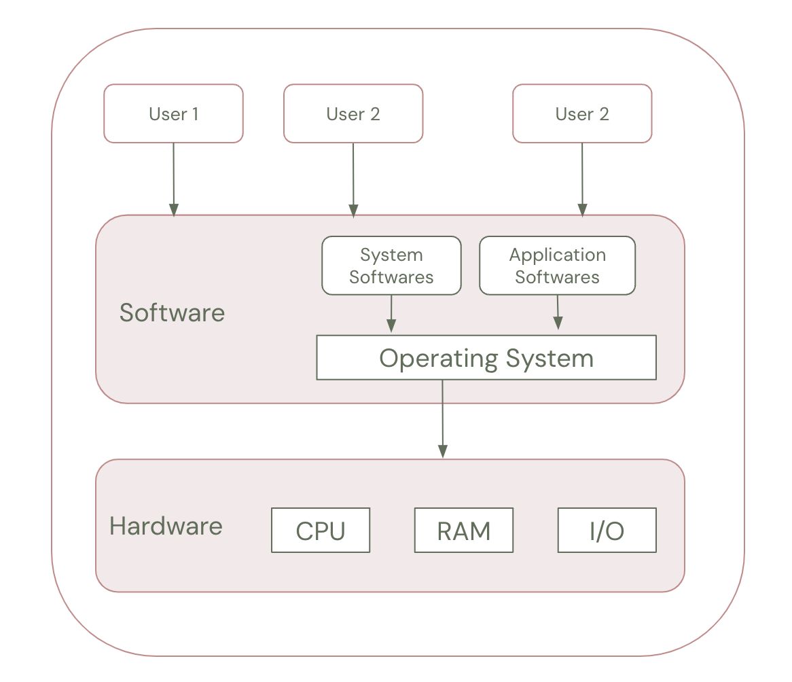
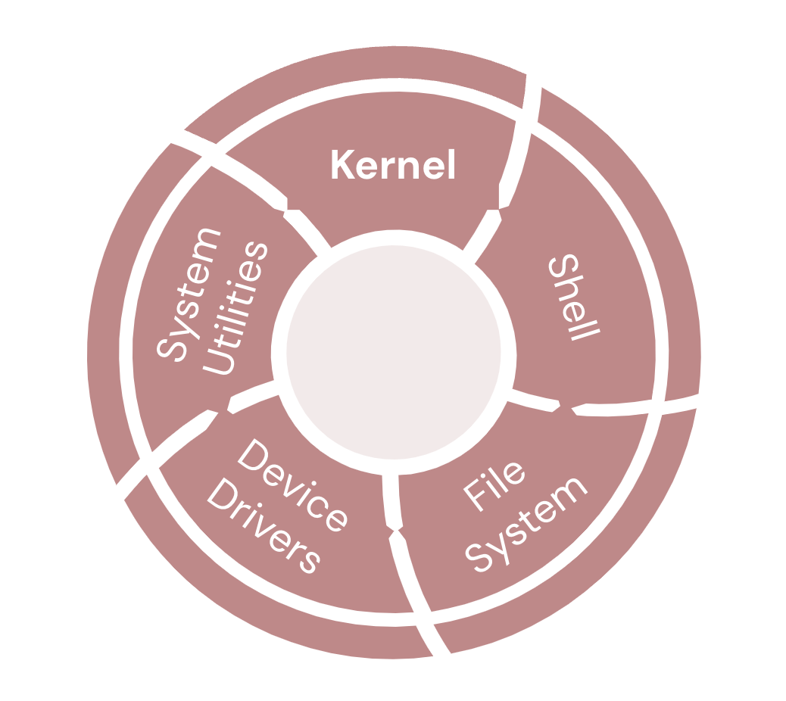

# Detailed Guide: Introduction to Operating Systems

## Lesson Overview

An operating system (OS) is the backbone of any computing system. It serves as a bridge between the user, applications, and the hardware, managing resources and providing essential services. This lesson introduces the concept of operating systems, their functions, components, and types. Learners will explore how operating systems have evolved and their role in enabling modern computing.

## Learning Objectives

By the end of this lesson, learners will be able to:

1. **Understand the Basics of Operating Systems**
   - Define an operating system and explain its purpose.
   - Identify the core functions and components of an OS.

2. **Recognize Different Types of Operating Systems**
   - Differentiate between single-user, multi-user, real-time, and distributed operating systems.

3. **Understand Key Concepts and Terminology**
   - Explore terms like multitasking, multithreading, and kernel.

4. **Appreciate the Role of Operating Systems**
   - Analyze how operating systems enable hardware and software interaction.

5. **Explore Examples of Popular Operating Systems**
   - Examine widely used operating systems like Windows, macOS, Linux, and Android.

## Detailed Explanation

### 1. What is an Operating System?

An **Operating System (OS)** is a system software that acts as an intermediary between the hardware of a computer and the user or application programs. It manages hardware resources like the CPU, memory, and storage while ensuring that software applications can function efficiently.

### Key Functions of an Operating System:

- **Resource Management:** Allocates CPU, memory, and storage resources to applications.
- **Process Management:** Handles the execution of multiple processes and ensures efficient multitasking.
- **File System Management:** Organizes, stores, retrieves, and manages data on storage devices.
- **Security and Access Control:** Protects system data and resources from unauthorized access.
- **User Interface (UI):** Provides an interface (CLI or GUI) for users to interact with the system.

---

### 2. Components of an Operating System

An OS consists of the following main components:

1. **Kernel:** The core part of the OS that manages hardware resources and system calls.
2. **Shell:** The interface between the user and the kernel (CLI or GUI).
3. **File System:** The mechanism for organizing and storing data on storage devices.
4. **Device Drivers:** Software modules that enable communication between the OS and hardware.
5. **System Utilities:** Programs that perform specialized tasks like disk cleanup, file search, or process monitoring.

---

### 3. Types of Operating Systems

1. **Single-User OS:**
   - Designed for one user at a time.
   - Example: Windows 10, macOS.

2. **Multi-User OS:**
   - Allows multiple users to access the system simultaneously.
   - Example: UNIX, Linux.

3. **Real-Time OS (RTOS):**
   - Processes data with minimal delay for time-sensitive tasks.
   - Example: VxWorks, RTLinux.

4. **Distributed OS:**
   - Manages a group of independent computers as a single system.
   - Example: Apache Hadoop, Beowulf.

5. **Embedded OS:**
   - Designed for embedded systems with limited resources.
   - Example: FreeRTOS, Android OS (for devices).

---

### 4. Key Concepts and Terminology

1. **Multitasking:** Running multiple tasks (processes) simultaneously.

2. **Multithreading:** Running multiple threads of a single process concurrently.

3. **Virtual Memory:** Simulating additional memory using disk space to extend RAM.

4. **Boot Process:** The sequence of events that occur when the system starts, loading the OS into memory.

---

### 5. Examples of Popular Operating Systems**
1. **Windows:** Widely used in personal and business environments.
2. **macOS:** Known for its stability and integration with Apple hardware.
3. **Linux:** Open-source and versatile, used in servers, desktops, and embedded systems.
4. **Android:** Powers the majority of smartphones globally.
5. **iOS:** Apple’s mobile operating system with a focus on security and user experience.

## Suggested Reading

["What is an Operating System?" by GeeksforGeeks](https://www.geeksforgeeks.org/what-is-an-operating-system/)