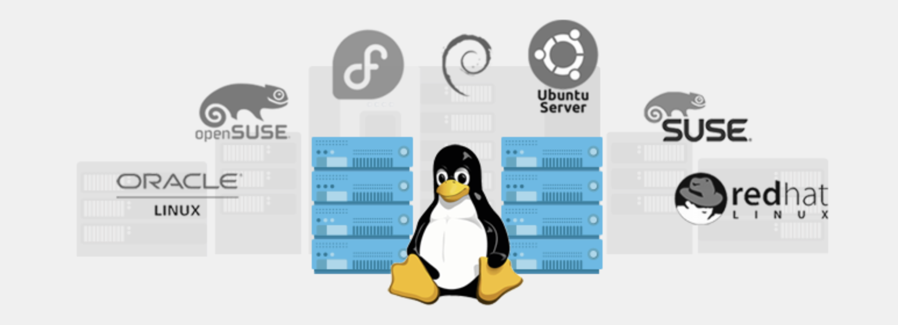

# Linux Operating System

## Overview:

Linux is one of the most significant technological breakthroughs of the twenty-first century. It has not only driven the growth of the Internet but also enabled a wide range of computer-powered devices. Beyond that, Linux has set a remarkable example of how collaborative efforts can achieve more than any single individual or company.

For instance, Google uses countless Linux servers to power its search engine. Android, the operating system running on billions of smartphones, is based on Linux. Even Google’s Chrome OS relies on Linux as its backbone to deliver a seamless browser experience.

Similarly, Facebook operates its platform using a LAMP stack, which stands for Linux, Apache (web server), MySQL (database), and PHP (scripting language). These are all open-source technologies. Facebook itself embraces the open-source model, sharing the source code for many of its tools and applications with the public. This approach helps Facebook find and fix bugs faster, attract global contributions, and sustain its rapid growth.

Linux is also trusted by financial organizations where speed and security are critical. Institutions like the New York Stock Exchange, Chicago Mercantile Exchange, and Tokyo Stock Exchange depend on Linux to handle transactions worth trillions of dollars with reliability and efficiency.

## Learning Objectives:

By the end of this lesson, you will be able to:

1. Understand the Linux Operating System: Gain a clear understanding of what the Linux Operating System is, including its core concepts and significance.

2. Identify Key Features of Linux: Explore the unique features of operating systems, with a specific focus on what makes Linux stand out.

3. Compare Different Linux Distributions: Learn about the differences between various Linux distributions and how they cater to different needs and use cases.

## Understanding What Linux is?

Linux is a computer operating system. An operating system consists of the software that manages your computer and lets you run applications on it. 

The features that make up Linux and similar computer operating systems include the following:

- **Detecting and preparing hardware** — When the Linux system boots up (when you turn on your computer), it looks at the components on your computer (CPU, hard drive, network cards, and so on) and loads the software (drivers and modules) needed to access those particular hardware devices.

- **Managing processes** — The operating system must keep track of multiple processes running at the same time and decide which have access to the CPU and when. The system also must offer ways of starting, stopping and changing the status of processes.

- **Managing memory —** RAM and swap space (extended memory) need to be allocated to applications as they need memory. The operating system decides how requests for memory are handled.

- **Providing user interfaces —** An operating system must provide ways of accessing the system. Linux machines can be accessed via CLI and Visual interface.

- **Controlling filesystems —** Filesystem structures are built into the operating system (or loaded as modules). The operating system controls ownership and access to the files and directories that the filesystems contain.

- **Providing user access and authentication —** Creating user accounts and allowing boundaries to be set between users is a basic feature of Linux. Separate user and group accounts enable users to control their own files and processes.

- **Offering administrative utilities —** In Linux, there are hundreds (perhaps thousands) of commands and graphical windows to do such things as add users, manage disks, monitor the network, install software, and generally secure and manage your computer.

- **Starting up services —** To use printers, handle log messages, and provide a variety of system and network services, processes run in the background, waiting for requests to come in. There are many types of services that run in Linux.

- Linux provides different ways of starting and stopping these services. In other words, while Linux includes web browsers to view web pages, it can also be the computer that serves up web pages to others. Popular server features include web, mail, database, printer, fi le, DNS, and DHCP servers.

- **Programming tools —** A wide variety of programming utilities for creatingapplications and libraries for implementing specialty interfaces are available with Linux.

## Linux Distributions:

**What is a Linux Distribution?**

A Linux Distribution (often referred to as a "distro") is a complete operating system built on the Linux kernel. The kernel is the core component of the operating system that interacts with the hardware. A distribution packages the Linux kernel with various software, utilities, and management tools to provide a functional and user-friendly environment for different use cases.

**Each distribution may include:**

- Desktop environments (e.g., GNOME, KDE)
- Package managers (e.g., APT, YUM, DNF)
- Pre-configured software (e.g., web servers, development tools, office applications)
- Custom configurations and support tailored for specific purposes (e.g., server, desktop, embedded systems)

**Key Differences Between Linux Distributions:**

Linux distributions differ based on various factors, making them suitable for specific audiences or use cases. Here are some of the critical differences:

### Purpose:

**Desktop-focused Distros:** Designed for personal computers with a user-friendly interface (e.g., Ubuntu, Linux Mint).
**Server-focused Distros:** Built for stability, security, and performance (e.g., CentOS, Debian, Ubuntu Server).
**Specialized Distros:** Tailored for niche applications like ethical hacking (e.g., Kali Linux) or lightweight systems (e.g., Alpine Linux).

### Package Management:

Distributions use different package managers to install and manage software:

- Debian-based Distros (Deb): Use .deb packages and the APT package manager (e.g., Ubuntu, Debian).
- Red Hat-based Distros (RPM): Use .rpm packages and YUM or DNF (e.g., CentOS, Fedora).
- Independent Distros: May use unique systems (e.g., Arch Linux with Pacman).

### Release Model:

- Rolling Release: Updates are continuous, providing the latest versions of software (e.g., Arch Linux, OpenSUSE Tumbleweed).

- Fixed Release: Software updates are bundled into specific versions released periodically (e.g., Ubuntu LTS, CentOS).

### Stability:

- Stable Distros: Prioritize reliability and are extensively tested (e.g., Debian Stable, CentOS).

- Cutting-Edge Distros: Include the latest software, often less tested but with the newest features (e.g., Fedora, Arch Linux).

### User Interface:

Some distributions provide pre-configured desktop environments, while others let users choose their preferred interface.

Examples of desktop environments: GNOME, KDE, XFCE, LXQt.

## Top Used Linux Distributions in the Industry:

1. Ubuntu

- Use Cases: Desktop, server, cloud, IoT

- Key Features:
    - User-friendly interface
    - Large community support
    - LTS (Long Term Support) versions for stability
    - Industries: Web development, education, cloud computing

2. CentOS Stream / RHEL (Red Hat Enterprise Linux)

- Use Cases: Enterprise servers, cloud platforms

- Key Features:
    - Enterprise-grade stability and support
    - Strong focus on security
    - Industries: Finance, government, large enterprises

3. Debian

- Use Cases: Servers, desktops

- Key Features:
    - Extremely stable and secure
    - Large software repository
    - Industries: Web hosting, data centers

4. Fedora

- Use Cases: Workstations, development environments

- Key Features:
    - Cutting-edge features
    - Backed by Red Hat
    - Industries: Development, testing environments

5. Arch Linux

- Use Cases: Customizable desktop systems

- Key Features:
    - Rolling release
    - Minimalist and lightweight
    - Industries: Power users, developers

6. Kali Linux

- Use Cases: Security testing, ethical hacking
- Key Features:
    - Pre-installed penetration testing tools
    - Focus on cybersecurity
    - Industries: Cybersecurity, penetration testing

7. SUSE / openSUSE

- Use Cases: Enterprise and personal computing
- Key Features:
    - Stability for enterprise environments (SUSE)
    - Tumbleweed for rolling release enthusiasts (openSUSE)
    - Industries: IT infrastructure, enterprises

8. Linux Mint

- Use Cases: Desktop systems
- Key Features:
    - User-friendly, ideal for beginners
    - Cinnamon desktop environment
    - Industries: Education, home computing

9. Alpine Linux

- Use Cases: Container environments, lightweight systems
- Key Features:
    - Minimalistic and secure
    - Popular for Docker images
    - Industries: Cloud computing, containerization

## Suggested Reading

[What is Linux Operating System](https://www.geeksforgeeks.org/introduction-to-linux-operating-system/)

[Linux Distributions](https://www.geeksforgeeks.org/what-are-linux-distributions/)

[Linux Basics](https://www.digitalocean.com/community/tutorials/an-introduction-to-linux-basics)

[What Is a Linux Distro, and How Are They Different from One Another?](https://www.howtogeek.com/132624/htg-explains-whats-a-linux-distro-and-how-are-they-different)

## YouTube Video Linux

[Introduction to Linux](https://www.youtube.com/watch?v=sWbUDq4S6Y8&t=98s&ab_channel=freeCodeCamp.org)
