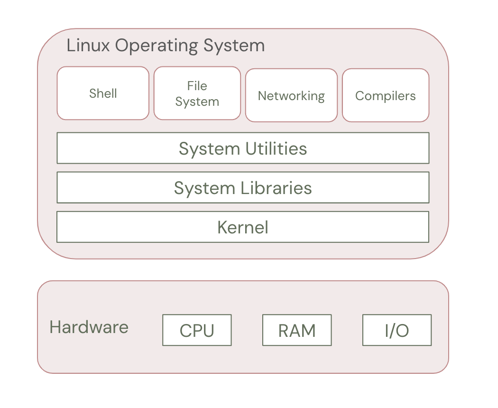

# Lesson: Architecture of the Linux Operating System


## Overview

Linux is a multi-user, multitasking operating system based on the UNIX architecture. It is known for its stability, security, and open-source nature, making it widely used in servers, embedded systems, and personal computing.

This lesson provides an in-depth understanding of the Linux operating system's architecture, exploring its components, functionalities, and interactions.


## Learning Objectives

By the end of this lesson, learners will:
1. Understand the Linux operating system architecture.
2. Learn the key components of the Linux OS and their functions.
3. Explore the working of the Linux kernel and its interactions with user processes.
4. Understand the role of shell, system libraries, and hardware abstraction.


## Topics Covered

1. Introduction to Linux OS Architecture
2. Key Components of Linux OS
3. The Kernel: Core of Linux OS
4. System Libraries: Interfacing with the Kernel
5. System Utilities: Essential OS Functions
6. The Shell: User Interaction with the OS
7. The Hardware Layer and Device Drivers
8. Process and Memory Management in Linux


## 1. Introduction to Linux OS Architecture

Linux follows a modular architecture that allows flexibility, scalability, and customization. The architecture is divided into several layers, which work together to provide an efficient and stable computing environment.

The key layers of the Linux architecture:
1. Hardware Layer: Physical devices like CPU, memory, storage, and I/O peripherals.
2. Kernel: The core of Linux, managing hardware, processes, and system resources.
3. System Libraries: Interfaces between applications and the kernel.
4. Shell (Command-Line Interface): User interface for executing commands.
5. Applications and Utilities: User programs and system tools.




## 2. Key Components of Linux OS

| Component      | Description |
|----|----|
| Kernel        | Core of the OS that interacts with hardware. |
| System Libraries | Standardized libraries providing functions for system calls. |
| System Utilities | Essential system management tools and utilities. |
| Shell         | Interface between users and the system. |
| File System   | Manages storage, files, and directories. |
| Networking    | Enables communication between systems. |


## 3. The Kernel: Core of Linux OS

The kernel is the heart of the Linux operating system, responsible for:
- Process management (scheduling, execution, and termination).
- Memory management (allocating and deallocating memory).
- Device management (controlling I/O devices).
- File system management (handling data storage and retrieval).
- Security & Networking (enforcing permissions and handling network protocols).

### Types of Linux Kernels
1. Monolithic Kernel (Default Linux Kernel)
   - All core functionalities are part of the kernel.
   - Offers better performance but has a larger codebase.
2. Microkernel
   - Minimal kernel, moving functions to user space for modularity.
   - Used in some experimental Linux distributions.


## 4. System Libraries: Interfacing with the Kernel

System libraries provide a set of functions and system calls to interact with the Linux kernel. These libraries help applications run smoothly without direct interaction with the kernel.

### Common Linux Libraries
- GNU C Library (glibc): Provides system calls like `open()`, `read()`, and `write()`.
- libm: Provides mathematical functions.
- libpthread: Supports multi-threading.

### How Libraries Work
1. An application requests an operation (e.g., opening a file).
2. System libraries translate the request into system calls.
3. The kernel executes the system call and interacts with hardware if needed.


## 5. System Utilities: Essential OS Functions

Linux provides a set of system utilities to perform common administrative tasks.

### Types of System Utilities
1. User Commands: Commands like `ls`, `cp`, `mv`, `grep`, `cat`.
2. Administrative Commands: `systemctl`, `service`, `mount`, `df`, `top`.
3. Network Commands: `ping`, `curl`, `wget`, `ifconfig`.

### Example Usage
- Viewing files:
  ```bash
  ls -l
  ```
- Managing processes:
  ```bash
  ps aux | grep firefox
  ```
- Checking system memory:
  ```bash
  free -h
  ```


## 6. The Shell: User Interaction with the OS

The shell is the command-line interface (CLI) that allows users to interact with the Linux system. It interprets user commands and passes them to the kernel.

### Types of Shells in Linux
| Shell Type | Description |
||-|
| Bash (Bourne Again Shell) | Default Linux shell, rich scripting support. |
| Zsh (Z Shell) | Enhanced features like auto-completion. |
| Fish (Friendly Interactive Shell) | User-friendly shell with syntax highlighting. |
| C Shell (csh) | C-like syntax, used in BSD-based systems. |

### Basic Shell Commands
```bash
echo "Hello, Linux!"
pwd   # Print current directory
cd /home  # Change directory
ls -al   # List all files
```


## 7. The Hardware Layer and Device Drivers

Linux needs device drivers to interact with hardware like CPUs, storage, and network devices.

### Types of Device Drivers
1. Character Devices: Used for serial communication (e.g., keyboards, mice).
2. Block Devices: Used for storage access (e.g., hard drives, USBs).
3. Network Devices: Manages communication interfaces (e.g., Ethernet, Wi-Fi).

### Managing Devices in Linux
- List all hardware devices:
  ```bash
  lshw
  ```
- View connected USB devices:
  ```bash
  lsusb
  ```
- List disk partitions:
  ```bash
  lsblk
  ```


## 8. Process and Memory Management in Linux

### Process Management
- Every running task is a process managed by the kernel.
- Use `ps` or `top` to monitor processes.

```bash
ps aux  # List all processes
kill <PID>  # Terminate a process
htop  # Interactive process viewer
```

### Memory Management
- Linux uses virtual memory, allowing applications to use more memory than physically available.
- Use `free` to check memory usage:

```bash
free -h  # Display memory usage
```

- Swap Space: Used when RAM is full, temporarily storing inactive processes.

```bash
swapon -s  # Show swap usage
```


## Suggested Reading and Resources

1. [The Linux Kernel Documentation](https://www.kernel.org/doc/html/latest/)
2. [Linux File System Hierarchy](https://tldp.org/LDP/Linux-Filesystem-Hierarchy/html/)