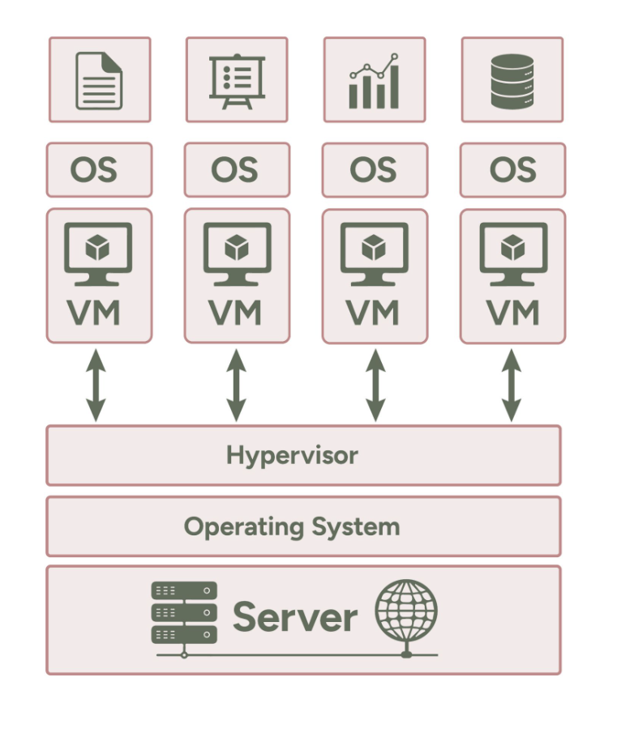

# A guide to Virtualization 

## Overview:

Virtualization is a transformative technology that allows multiple operating systems and applications to run on a single physical machine by creating virtual environments. This lesson explores the fundamentals of virtualization, its necessity in modern computing, and its impact on efficiency, cost savings, and scalability. We’ll also dive into how Linux plays a pivotal role in virtualization, the tools it offers, and its real-world applications across industries.

## Learning Objectives:

By the end of this lesson, learners will be able to:

1. Understand the Concept and Need for Virtualization

2. Explore Benefits and Use Cases 

    - Identify key advantages of virtualization, including resource efficiency, scalability, and disaster recovery.
Describe common use cases such as server consolidation, development environments, and cloud computing.

3. Recognize Linux’s Role in Virtualization

    - Understand Linux-based virtualization tools like KVM, Docker, and Xen, and their applications.

## Explanation:

### Why Virtualization is needed?

Virtualization emerged as a response to several challenges faced in traditional computing environments. Below are the key reasons that drove the development and adoption of virtualization technologies:

**1. Inefficient Resource Utilization**

- **Problem:** Traditional systems often ran one application per server to avoid conflicts, leading to underutilized hardware resources.

- **Example:** A server with significant CPU and memory capacity might only use 20% of its resources.
Solution: Virtualization allows multiple operating systems and applications to share the same physical hardware, maximizing resource usage and improving efficiency.

**2. High Costs of Hardware and Maintenance**

- **Problem:** Running separate physical servers for each application increased hardware acquisition costs, maintenance expenses, and energy consumption.

- **Solution:** By consolidating multiple workloads onto fewer physical servers using virtualization, organizations can significantly reduce costs related to hardware, power, cooling, and physical space.

**3. Scalability Challenges**

- **Problem:** Scaling up or down in traditional setups required purchasing, deploying, and configuring new physical servers, which was time-consuming and expensive.

- **Solution:** Virtualization allows organizations to quickly provision or decommission virtual machines, providing flexibility to scale resources on demand.

**4. Limited Flexibility for Testing and Development**

- **Problem:** Developers and testers needed dedicated hardware for testing new software or environments, which could be expensive and time-intensive to set up.

- **Solution:** Virtualization enables the creation of isolated environments (virtual machines or containers) that can replicate production setups for testing and development without additional hardware.

**5. Need for Disaster Recovery and Business Continuity**

- **Problem:** Restoring physical systems after hardware failures or disasters was slow and complicated, leading to extended downtime.

- **Solution:** Virtualization allows organizations to take snapshots, backups, and replicas of virtual machines, making recovery fast and reliable.

**6. Challenges in Application Isolation**

- **Problem:** Running multiple applications on the same physical server could lead to conflicts and instability, as they often depended on different software or configurations.

- **Solution:** Virtualization ensures that applications run in isolated environments (VMs or containers), preventing conflicts and ensuring stability.

**7. Environmental Concerns**

- **Problem:** Large data centers with multiple physical servers consumed significant amounts of electricity, contributing to high operational costs and environmental issues.

- **Solution:** Virtualization reduces the number of physical machines required, leading to lower power consumption and a smaller carbon footprint.

**8. The Rise of Cloud Computing**

- **Problem:** Traditional IT infrastructure made it challenging to provide scalable, on-demand computing resources for businesses and users.

- **Solution:** Virtualization became the foundation of cloud computing, enabling Infrastructure-as-a-Service (IaaS), where users can rent virtual resources as needed.

**9. Complexity in Managing Diverse Workloads**

- **Problem:** Organizations needed to support diverse workloads, from databases to web servers, often requiring separate hardware and software configurations.

- **Solution:** Virtualization simplifies management by allowing diverse workloads to coexist on the same physical server with isolated environments.

**10. Speed of Deployment**

- **Problem:** Setting up and deploying physical servers took time, often delaying project timelines.

- **Solution:** Virtual machines and containers can be deployed in minutes, significantly speeding up project deployment and delivery.

## What is Virtualization?

Virtualization is a technology that allows multiple operating systems (OS) and applications to run on a single physical machine by abstracting the hardware resources. It involves creating virtual instances of computing environments, such as servers, storage, or networks, within a single physical system. In the context of Linux, virtualization enables you to use Linux as a host operating system to manage and run virtual machines (VMs) and other resources.

### How Virtualization Works in Linux?

Linux supports virtualization through tools and technologies such as:

1. Hypervisors: Software that creates and manages virtual machines by allocating physical resources to them.
Examples: KVM (Kernel-based Virtual Machine), Xen, and QEMU.

2. Containers: Lightweight, virtualized environments that share the host OS kernel but are isolated from each other.

Examples: Docker, LXC, and Podman.

### Key Components of Virtualization in Linux:

1. Host OS: The physical machine running the virtualization software.
2. Hypervisor: Software that allocates resources and manages virtual machines.
3. Guest OS: The operating systems running inside the virtual machines.

### Benefits of Virtualization in Linux

1. Efficient Resource Utilization

    - Maximizes the use of CPU, memory, and storage by running multiple workloads on a single physical server.

2. Cost Savings

    - Reduces the need for physical hardware, lowering costs associated with purchasing, maintaining, and powering multiple machines.

3. Scalability and Flexibility

    - Easily scale up or down virtual machines based on workload requirements.

4. Isolation and Security

    - Each VM or container operates independently, minimizing the risk of one affecting another.

5. Ease of Testing and Development

    - Developers can create isolated environments for testing without impacting the host system.

6. Disaster Recovery

    - Virtual machines can be quickly backed up, migrated, and restored in case of failures.

7. Energy Efficiency

    - Consolidates workloads on fewer servers, reducing power consumption and the environmental footprint.

### Use Cases of Virtualization:

1. Server Consolidation:

    - Combine multiple physical servers into fewer virtual machines to optimize resource usage and reduce hardware costs.

2. Development and Testing:

    - Developers can test software in isolated environments that replicate production setups.

3. Cloud Computing

    - Virtualization is the backbone of cloud platforms like AWS, Google Cloud, and Microsoft Azure.

4. Virtual Desktop Infrastructure (VDI)

    - Provides users with virtual desktops accessible from any device, enhancing remote work capabilities.

5. High Availability and Disaster Recovery

    - VMs can be replicated across data centers, ensuring business continuity during outages.

6. Containerization

    - Use tools like Docker to deploy applications in lightweight, portable containers.

7. Big Data and Machine Learning

    - Virtualized environments provide scalable resources for running big data analytics and ML workloads.

### How Virtualization Has Revolutionized the World of Computing?

1. The Rise of Cloud Computing

    - Virtualization enables Infrastructure-as-a-Service (IaaS), allowing businesses to rent virtual servers and scale resources on demand.

2. DevOps and CI/CD Pipelines

    - Virtualized environments make it easier to implement DevOps practices, ensuring faster and more reliable deployments.

3. Edge Computing

    - Virtualization powers small, efficient computing nodes at the edge of networks for faster data processing.

4. Enhanced Collaboration

    - Virtual environments allow teams to work on shared projects from anywhere in the world.

5. Open-Source Innovation

    - Linux-based virtualization technologies like KVM and Docker have spurred innovation in open-source communities.

6. Environmental Impact

    - By reducing the number of physical machines, virtualization significantly lowers energy consumption and electronic waste.

### Popular Virtualization Tools in Linux

1. KVM (Kernel-based Virtual Machine):

    - Built into the Linux kernel.
    - Allows full virtualization for Linux and Windows guests.

2. Xen:

    - An open-source hypervisor known for its scalability and flexibility.

3. QEMU:

    - A hardware emulator that supports full-system and user-mode virtualization.

4. VirtualBox:

    - A user-friendly virtualization tool that supports multiple platforms.

5. Docker:

    - A leading containerization platform for building, shipping, and running applications.

6. LXC (Linux Containers):

    - A lightweight virtualization method that shares the host kernel.

## Suggested Reading

- [What is Virtualisation? from IBM Blogs](https://www.ibm.com/think/topics/virtualization)

- [What is Virtualisation? from MS Azure](https://azure.microsoft.com/en-au/resources/cloud-computing-dictionary/what-is-virtualization)