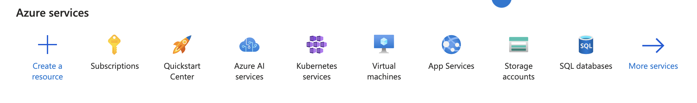
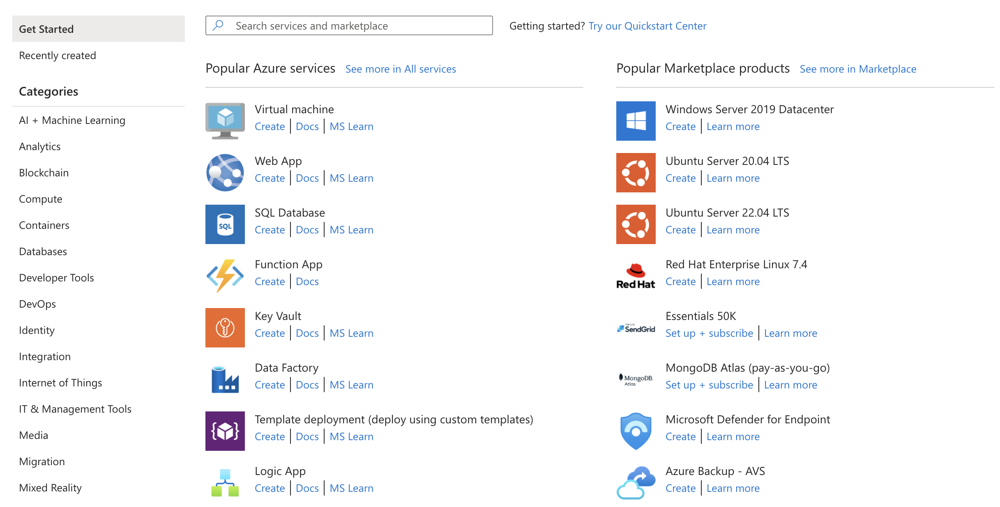
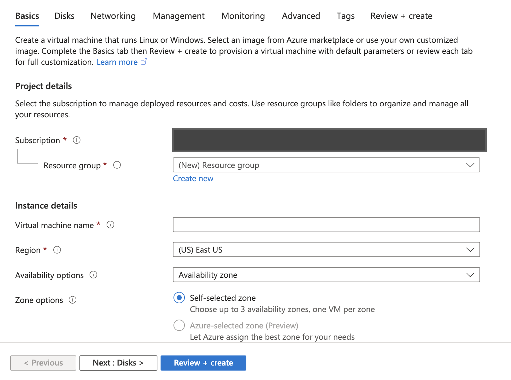

# Lab: Provisioning a Linux Virtual Machine on Azure Portal

Virtual Machines (VMs) are one of the core compute services in Azure, allowing users to deploy scalable, on-demand, and customizable virtual environments. This lab will guide you through the process of provisioning a Linux Virtual Machine (VM) on Azure Portal, configuring networking and authentication, and securely accessing the VM using SSH.

## Pre-requisites
Before starting this lab, ensure that you have:
1. An active Azure subscription.
2. A valid Azure account with sufficient permissions to create resources.
3. Internet access and a web browser to access the Azure Portal.

## Learning Objectives
By the end of this lab, you will be able to:
1. Navigate to the Azure Portal and create a Linux Virtual Machine (VM).
2. Configure VM settings such as size, region, authentication method, and networking.
3. Access the Linux VM via SSH using an SSH client.
4. Manage and verify the status of the VM in the Azure Portal.

## Step-by-Step Guide

### Step 1: Log in to Azure Portal
1. Open your web browser and go to [Azure Portal](https://portal.azure.com).
2. Sign in using your Azure credentials.

### Step 2: Create a Linux Virtual Machine
1. In the Azure Portal, click on "Create a resource".


2. Under Compute, select "Virtual Machine".


3. Click "Create" under the Virtual Machine section.

### Step 3: Configure the Basic Settings
1. Subscription: Select your Azure subscription.



2. Resource Group: Click "Create new" and enter a name (e.g., `MyResourceGroup`).
3. Virtual Machine Name: Enter a unique name for your VM (e.g., `MyLinuxVM`).
4. Region: Select the Azure region closest to you (e.g., `East US`).
5. Availability Options: Choose "No infrastructure redundancy required".
6. Image: Select "Ubuntu 20.04 LTS" (or another Linux distribution).
7. Size: Click on "See all sizes", and choose a VM size based on your needs (e.g., `Standard_B1s`).

### Step 4: Configure Authentication
1. Authentication Type: Select "SSH public key".
2. Username: Enter a preferred admin username (e.g., `azureuser`).
3. SSH Public Key Source:
   - If you have an existing SSH key, select "Use existing key stored in Azure".
   - To generate a new key, select "Generate new key pair" and download it for later use.


### Step 5: Configure Networking
1. Virtual Network: Choose "Create new" and enter a name (e.g., `MyVNet`).
2. Subnet: Leave the default subnet settings.
3. Public IP: Ensure that "Create a new public IP" is selected.
4. Inbound Ports: Select "Allow selected ports" and choose SSH (22).
5. Network Security Group (NSG): Keep the default settings.

### Step 6: Configure Disks and Advanced Settings (Optional)
1. Under Disks, select Standard SSD for better performance.
2. Enable Boot Diagnostics to troubleshoot boot issues.

### Step 7: Review and Create the VM
1. Click on "Review + create".
2. Azure will validate your configurations.
3. Once validation passes, click "Create" to deploy the VM.
4. Wait for the deployment to complete (this may take a few minutes).


### Step 8: Connect to the Virtual Machine via SSH
1. Go to the Azure Portal and navigate to your deployed Linux VM.
2. Click on "Connect" > "SSH".
3. Copy the SSH command provided by Azure.
4. Open a terminal (on macOS/Linux) or PowerShell (on Windows).
5. Paste and execute the SSH command:
   ```
   ssh azureuser@<Public_IP_Address>
   ```
6. If prompted, type "yes" to accept the connection.


### Step 9: Verify VM Access and Run Basic Commands
Once connected, try the following commands:
1. Check OS details:
   ```
   lsb_release -a
   ```
2. Check disk space:
   ```
   df -h
   ```
3. Update package lists:
   ```
   sudo apt update && sudo apt upgrade -y
   ```


## Conclusion
Congratulations! You have successfully provisioned a Linux Virtual Machine on Azure and accessed it via SSH. You can now install software, host applications, and manage configurations as per your requirements.
